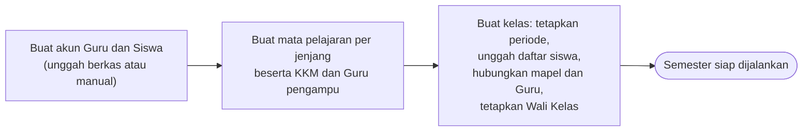
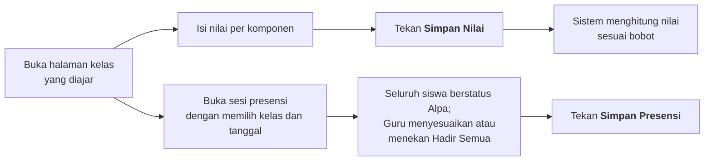
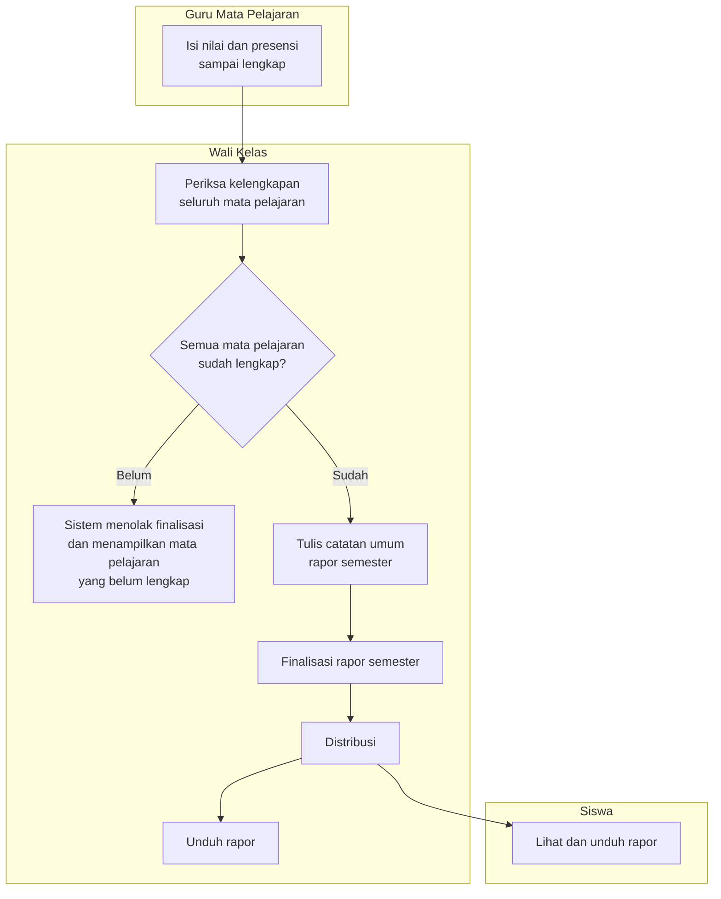
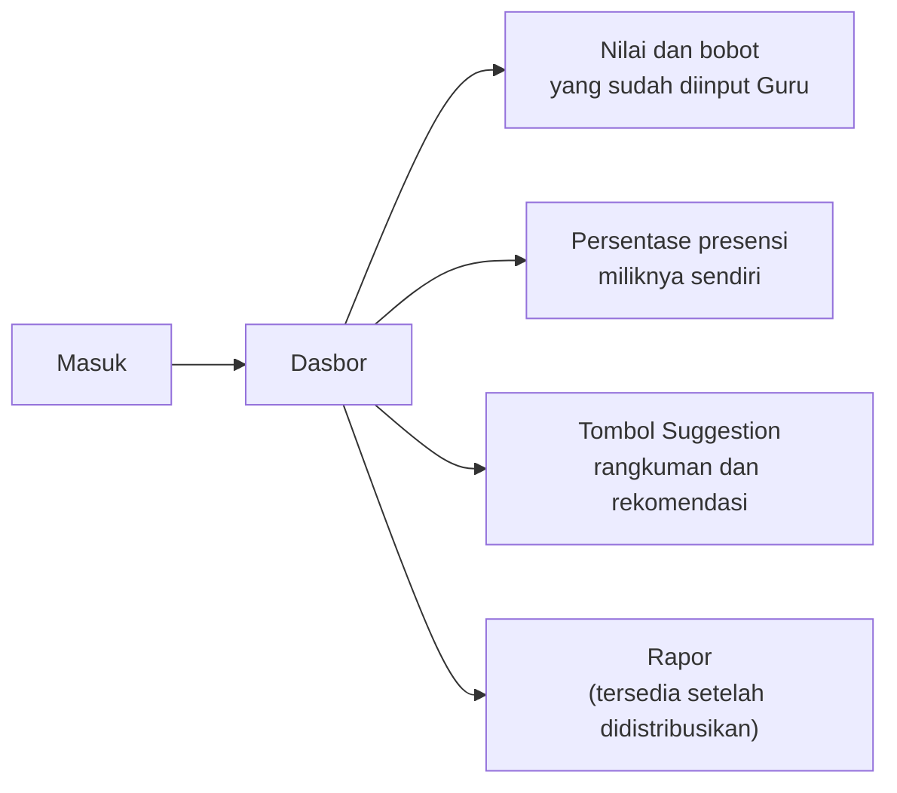
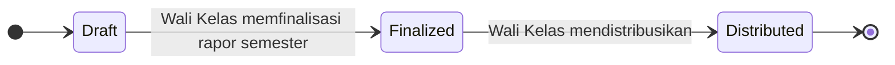

# Product Requirements Document — EduTrack

| Keterangan | Isi |
|---|---|
| **Nama produk** | EduTrack |
| **Project ID** | EDU-2026-001 |
| **Versi** | v3.0 |
| **Tanggal** | 5 Agustus 2026 |
| **Disusun oleh** | Re:Code |
| **Pengguna MVP** | Administrator, Guru (termasuk Guru yang ditugaskan sebagai Wali Kelas), dan Siswa |
| **Kedudukan** | Turunan dari PRD MVP Final. Menggantikan seluruh versi PRD.md sebelumnya. Aturan produk, use case, layar, kriteria kesiapan, dan butir validasi sekolah berada pada [ATURAN-DAN-KRITERIA.md](ATURAN-DAN-KRITERIA.md) |

> Dokumen ini menguraikan **apa** yang dibangun beserta alasannya, sepenuhnya dari sisi aplikasi.
> Arsitektur, basis data, antarmuka program, dan pilihan teknologi **tidak dibahas di sini** dan disusun terpisah pada dokumen spesifikasi teknis.
>
> Butir validasi pada [ATURAN-DAN-KRITERIA.md §5](ATURAN-DAN-KRITERIA.md) wajib dikonfirmasi dengan pihak sekolah sebelum sistem menggunakan data sekolah yang sebenarnya.

---

## Inti Produk

EduTrack membantu sekolah mencatat nilai dan presensi secara teratur, memperlihatkan perkembangan siswa sebelum rapor terbit, kemudian menyatukan seluruh nilai menjadi rapor semester yang dapat dibagikan kepada siswa.

**Lima keputusan produk yang paling menentukan:**

1. Terdapat tiga jenis akun: Administrator, Guru, dan Siswa.
2. Seluruh Guru mengajar mata pelajaran tertentu. Sebagian Guru juga ditetapkan sebagai Wali Kelas.
3. Guru hanya mengelola kelas dan mata pelajaran yang ditugaskan kepadanya.
4. Wali Kelas dapat melihat seluruh nilai mata pelajaran pada kelas walinya, tetapi tidak dapat mengubah nilai milik Guru lain.
5. **Finalisasi rapor semester dilakukan Wali Kelas.** Guru Mata Pelajaran tidak melakukan finalisasi.

---

## 1. Latar Belakang dan Permasalahan

Pada sebagian sekolah, nilai tugas dan ujian baru diketahui secara lengkap ketika rapor telah terbit.

| Pemangku kepentingan | Dampak yang dialami |
|---|---|
| **Siswa dan orang tua** | Tidak mengetahui nilai mana yang rendah, topik mana yang perlu ditingkatkan, bagaimana bobot setiap penilaian, maupun apa yang harus segera diperbaiki selagi waktu masih tersedia |
| **Guru Mata Pelajaran** | Membutuhkan cara yang lebih cepat untuk memeriksa kelengkapan nilai dan presensi seluruh siswa |
| **Wali Kelas** | Perlu menghimpun dan memeriksa kesiapan seluruh mata pelajaran sebelum rapor semester dapat disusun |

### 1.1 Akar permasalahan

Permasalahan utama bukan ketiadaan aplikasi, melainkan **rentang waktu antara pencatatan nilai dan diketahuinya nilai tersebut oleh siswa**. Guru telah memiliki data sejak penilaian pertama, sementara siswa baru mengetahuinya ketika tindakan perbaikan sudah tidak dapat dilakukan.

---

## 2. Solusi yang Ditawarkan

EduTrack menyediakan satu aplikasi web yang:

- memberi siswa akses terhadap nilai, bobot penilaian, presensi, dan rekomendasi belajar miliknya sendiri;
- membantu Guru Mata Pelajaran mencatat nilai dan presensi serta memantau perkembangan siswa;
- membantu Wali Kelas memeriksa kesiapan seluruh mata pelajaran, memfinalisasi rapor semester, dan mendistribusikannya.

---

## 3. Tujuan Produk

| # | Tujuan |
|---|---|
| G1 | Membuat nilai, bobot penilaian, dan pencatatan presensi lebih transparan |
| G2 | Mengurangi pekerjaan rekapitulasi manual pada saat penyusunan rapor |
| G3 | Memungkinkan siswa mengetahui kekurangannya pada nilai tertentu dan memperoleh rekomendasi belajar yang mudah dipahami |

---

## 4. Batas MVP

MVP adalah versi awal yang hanya memuat fungsi paling penting agar alur sekolah dapat diuji dari awal sampai akhir.

### 4.1 Masuk MVP

| # | Cakupan |
|---|---|
| M1 | Pembuatan akun Guru dan Siswa melalui **unggah berkas CSV atau pengisian manual**, dengan **kata sandi awal dibuat sistem**. **Sesi kelas dibuka Guru Mata Pelajaran** pada saat mencatat presensi |
| M2 | Administrator menugaskan Kelas, Siswa, Guru, Mata Pelajaran, Semester, dan Tahun Ajaran. **Mata pelajaran dibuat per jenjang** — misalnya Matematika X, Biologi XI — dan penugasan berlangsung dalam tiga lapis sebagaimana diuraikan pada [§8.2](#82-struktur-mata-pelajaran-dan-penugasan) |
| M3 | Administrator menetapkan **KKM per mata pelajaran-jenjang** pada saat mata pelajaran dibuat. Komponen penilaian dan bobot memakai **templat bawaan sistem** yang berlaku untuk seluruh mata pelajaran ([§8.3](#83-komponen-penilaian-bobot-dan-kkm)) |
| M4 | **Guru Mata Pelajaran** membuka sesi presensi serta menginput nilai dan presensi siswa |
| M5 | **Wali Kelas** memfinalisasi rapor, mendistribusikan rapor, serta mengunduh nilai dan rapor |
| M6 | AI Insight untuk siswa |
| M7 | Pembobotan penilaian **hanya untuk ranah Pengetahuan** |
| M8 | **Unggah berkas** untuk akun Guru dan Siswa (CSV) serta daftar siswa per kelas (Excel), disertai templat yang dapat diunduh |
| M9 | **Pemberitahuan berhasil atau gagal** pada setiap proses administrasi |

### 4.2 Belum Masuk MVP

| # | Di luar cakupan | Keterangan |
|---|---|---|
| NG1 | Portal khusus orang tua | Orang tua mengakses melalui akun siswa |
| NG2 | Integrasi dengan aplikasi sekolah lain | Tidak ada pertukaran data dengan sistem pihak ketiga |
| NG3 | Banyak pilihan templat rapor | Hanya tersedia satu format |
| NG4 | Prediksi kelulusan atau keputusan otomatis | Bertentangan dengan batasan AI pada §8.6 |
| NG5 | Aplikasi mobile Android/iOS | Antarmuka web, tetap wajib terbaca pada perangkat bergerak |
| NG6 | RPS atau modul rencana pembelajaran | — |
| NG7 | AI Learning Coach untuk membuat latihan soal | — |
| NG8 | Kenaikan kelas | Perpindahan tahun ajaran belum ditangani sistem |
| NG9 | Riwayat nilai jenjang sebelumnya | Sistem hanya menyajikan periode berjalan |
| NG10 | Pembobotan dinamis per mata pelajaran | Komponen dan bobot mengikuti ketetapan Administrator |
| NG11 | **Penilaian Keterampilan, Sikap Sosial, dan Sikap Spiritual** | MVP hanya menangani ranah Pengetahuan |
| NG12 | **Umpan balik atau tindak lanjut presensi pada halaman presensi** | Halaman presensi hanya menampilkan persentase, tanpa peringatan maupun anjuran. AI Insight tetap boleh menyebut presensi sebagai konteks penjelas ([§8.5](#85-ai-insight--tombol-suggestion)) |
| NG14 | **Penyimpanan riwayat rekomendasi AI** | Keluaran bersifat sementara dan tidak tersimpan |
| NG15 | **Jadwal mengajar** | Sistem tidak mengetahui pertemuan yang seharusnya terjadi. Sesi dibuka Guru secara manual, tanpa jumlah minimum |
| NG16 | **Ambang kehadiran minimum** | Tidak ada batas persentase yang ditetapkan sekolah di dalam sistem |
| NG17 | **Unggah dokumen pendukung izin** | Status Izin dan Sakit dicatat tanpa surat, berkas, maupun lampiran bukti |

---

## 5. Pengguna dan Peran

| Peran | Jenis | Cakupan kerja | Terhadap nilai akademik |
|---|---|---|---|
| **Administrator** | Jenis akun | Seluruh sekolah | **Akses penuh**, termasuk mengisi dan mengubah nilai |
| **Guru Mata Pelajaran** | Jenis akun | Kelas dan mata pelajaran yang ditugaskan kepadanya | Mengisi dan menyunting, terbatas pada penugasannya |
| **Wali Kelas** | **Kewenangan tambahan** pada akun Guru | Satu kelas asuhan, seluruh mata pelajaran | Hanya membaca; tidak dapat mengubah nilai Guru lain |
| **Siswa** | Jenis akun | Dirinya sendiri | Hanya membaca |

Seluruh Guru merupakan Guru Mata Pelajaran. Wali Kelas bukan jenis akun baru, melainkan kewenangan tambahan yang diberikan Administrator kepada Guru tertentu. Satu orang dapat memegang kedua fungsi tersebut sekaligus.

### 5.1 Administrator

Administrator menyiapkan data dan aturan sekolah, serta memiliki akses penuh terhadap seluruh data termasuk nilai akademik.

1. Membuat akun Guru dan Siswa melalui unggah berkas atau pengisian manual, dengan kata sandi awal yang dibuat sistem ([§6.1.1](#611-pembuatan-akun-guru) dan [§6.1.2](#612-pembuatan-akun-siswa))
2. Membuat mata pelajaran per jenjang beserta KKM, dan menghubungkannya dengan Guru pengampu ([§6.1.4](#614-pembuatan-mata-pelajaran))
3. Membuat kelas beserta periode akademiknya, mengunggah daftar siswa, menghubungkan mata pelajaran dan Guru pengampunya, serta menetapkan Wali Kelas ([§6.1.5](#615-pembuatan-kelas))
4. Mengisi dan mengubah nilai akademik apabila diperlukan

### 5.2 Guru Mata Pelajaran

Guru hanya dapat bekerja pada kelas dan mata pelajaran yang diberikan oleh Administrator.

1. Mengisi dan menyunting nilai
2. Membuka sesi presensi, menetapkan dan menyunting status kehadiran, serta menghapus sesi yang keliru
3. Melihat progres siswa pada penugasannya
5. **Tidak melakukan finalisasi rapor**

### 5.3 Wali Kelas

Wali Kelas merupakan kewenangan tambahan pada akun Guru.

1. Melihat nilai seluruh mata pelajaran milik siswa di kelas walinya
2. Memeriksa apakah seluruh Guru telah menginput semua nilai
3. Menulis atau menyunting catatan umum rapor semester
4. Memfinalisasi rapor semester setelah seluruh mata pelajaran lengkap
5. Mendistribusikan rapor kepada siswa
6. Mengunduh rapor
7. **Tidak dapat mengubah nilai yang dibuat oleh Guru Mata Pelajaran lain**

### 5.4 Siswa

1. Melihat nilai dan bobot penilaian segera setelah Guru menginputnya
2. Melihat persentase presensi miliknya sendiri
3. Memperoleh rangkuman dan rekomendasi belajar melalui tombol Suggestion
4. Melihat dan mengunduh rapor setelah Wali Kelas mendistribusikannya

---

## 6. Alur Kerja Utama

> Setiap alur disajikan dalam dua bentuk yang menggambarkan hal yang sama:
> **gambar** untuk pembacaan manusia, dan **blok Mermaid** untuk pemrosesan otomatis
> serta perenderan pada GitHub, VS Code, dan Notion.

### 6.1 Persiapan semester — Administrator



#### 6.1.1 Pembuatan akun Guru

1. Administrator mengunggah berkas CSV atau mengisi manual. Isi data hanya **Nama** dan **NIP**
2. Sistem membuat **kata sandi awal secara otomatis** untuk setiap Guru
3. Guru masuk aplikasi menggunakan **NIP dan kata sandi**
4. Guru **belum memiliki peran apa pun** sampai dihubungkan dengan mata pelajaran

#### 6.1.2 Pembuatan akun Siswa

1. Administrator mengunggah berkas CSV atau mengisi manual. Isi data hanya **Nama** dan **NIS**
2. Sistem membuat **kata sandi awal secara otomatis** untuk setiap Siswa
3. Siswa masuk aplikasi menggunakan **NIS dan kata sandi**
4. Siswa **belum berada di kelas mana pun** sampai kelas dibuat

#### 6.1.3 Kata sandi awal

Kata sandi dibuat sistem untuk setiap akun Guru dan Siswa, lalu ditampilkan kepada Administrator agar dapat diserahkan kepada pengguna yang bersangkutan. **Tidak ada syarat kerumitan kata sandi** dan tidak ada kewajiban penggantian pada masuk pertama.

**Lupa kata sandi.** Tidak tersedia pemulihan kata sandi secara mandiri. Tombol **Lupa kata sandi** tetap ada pada halaman masuk, tetapi ketika ditekan hanya menampilkan pesan:

> Tolong hubungi Wali Kelas / Admin Sekolah.

Tidak ada tautan yang dikirim, tidak ada surel, dan kata sandi tidak berubah. Penggantian kata sandi dilakukan Administrator.

#### 6.1.4 Pembuatan mata pelajaran

1. Dibuat manual, memuat **nama mata pelajaran, jenjang, KKM, dan Guru pengampu** yang dipilih dari daftar
2. Satu mata pelajaran memiliki **tepat satu jenjang dan satu Guru pengampu**, dan satu Guru hanya mengampu satu mata pelajaran pada satu jenjang
3. Setelah dihubungkan, Guru memperoleh peran mengajar, misalnya Matematika X

#### 6.1.5 Pembuatan kelas

1. Administrator menekan tombol buat kelas baru
2. Menetapkan **periode akademik**: semester dan tahun ajaran dipilih dari daftar. Proses dapat dibatalkan atau dilanjutkan
3. Apabila dilanjutkan, Administrator **mengunggah daftar siswa** dalam berkas Excel. Templat dapat diunduh apabila belum tersedia; isi templat adalah **Kelas, NIS, dan Nama siswa**. **NIS menjadi kunci pencocokan** dengan akun siswa yang sudah ada; nama hanya dipakai sebagai pemeriksaan
4. Administrator **menghubungkan kelas dengan mata pelajaran beserta Guru pengampunya**, sesuai penugasan yang sudah dibuat pada [§6.1.4](#614-pembuatan-mata-pelajaran). Guru yang jenjang mata pelajarannya tidak sama dengan jenjang kelas akan ditolak
5. Administrator menetapkan salah satu Guru sebagai **Wali Kelas**
6. Guru tersebut memperoleh kewenangan tambahan Wali Kelas
7. **Satu proses menghasilkan satu kelas.** Pembuatan kelas berikutnya mengulang proses dari awal

#### 6.1.6 Umpan balik proses

**Setiap interaksi yang memasukkan atau mengubah data — di seluruh aplikasi, bukan hanya pada §6.1 — wajib menampilkan pemberitahuan berhasil atau gagal.** Termasuk di dalamnya unggah berkas, pembuatan akun, penetapan peran, pembuatan kelas, penyimpanan nilai, penyimpanan presensi, penghapusan sesi, finalisasi, dan distribusi rapor.

Pemberitahuan kegagalan menyebutkan alasannya, misalnya baris berkas yang tidak terbaca atau data yang tidak lengkap.

### 6.2 Pencatatan nilai dan presensi — Guru Mata Pelajaran



Penyimpanan **tidak berlangsung otomatis**. Nilai baru tersimpan setelah Guru menekan **Simpan Nilai**, dan presensi baru tersimpan setelah Guru menekan **Simpan Presensi**. Kedua tombol menampilkan pemberitahuan berhasil atau gagal.

### 6.3 Finalisasi dan distribusi rapor — Wali Kelas

Finalisasi dilakukan **satu kali**, oleh Wali Kelas, setelah seluruh mata pelajaran pada kelas asuhannya lengkap.

**Penanda data belum lengkap.** Kelengkapan data hanya diberitahukan **pada saat finalisasi rapor**. Apabila masih terdapat mata pelajaran yang belum lengkap, sistem menolak finalisasi dan menampilkan pesan berikut untuk setiap mata pelajaran tersebut:

> Data Mapel *&lt;nama mata pelajaran&gt;* belum ada, tolong hubungi guru yang bertanggung jawab.

Di luar momen finalisasi, sistem **tidak** menampilkan pemberitahuan kelengkapan data dalam bentuk apa pun.



Rapor dapat diunduh oleh **Wali Kelas** setelah difinalisasi, dan oleh **Siswa** setelah didistribusikan. Guru Mata Pelajaran tidak memiliki jalur pengunduhan.

### 6.4 Akses nilai — Siswa



---

## 7. Fitur Wajib MVP

| Bagian | Fitur yang wajib tersedia |
|---|---|
| **Administrasi** | Pembuatan akun melalui unggah CSV atau manual dengan kata sandi otomatis, mata pelajaran per jenjang beserta KKM dan Guru pengampu, pembuatan kelas beserta periode akademik dan unggah daftar siswa, templat berkas yang dapat diunduh, penghubungan kelas dengan mata pelajaran dan Guru, pemeriksaan kecocokan jenjang, serta penetapan Wali Kelas |
| **Nilai** | Input dan edit manual, tombol **Simpan Nilai**, perhitungan nilai menurut templat bobot, serta tampilan nilai bagi siswa |
| **Presensi** | Pembukaan dan penghapusan sesi, pencatatan status hadir/izin/sakit/alpa per sesi, tombol **Hadir Semua**, tombol **Simpan Presensi**, penyuntingan, dan **persentase kehadiran** |
| **Rapor Semester** | Nilai dari seluruh mata pelajaran, catatan Wali Kelas, finalisasi, pembuatan berkas rapor, distribusi, serta unduh oleh Wali Kelas dan Siswa |
| **AI Insight** | Tombol Suggestion berisi rangkuman capaian dan rekomendasi belajar untuk siswa |

**Berlaku menyeluruh:** setiap interaksi yang memasukkan atau mengubah data wajib menampilkan pemberitahuan berhasil atau gagal ([§6.1.6](#616-umpan-balik-proses)).

---

## 8. Kemampuan Sistem

### 8.1 Matriks kewenangan

| Kemampuan | Administrator | Guru Mapel | Wali Kelas | Siswa |
|---|:--:|:--:|:--:|:--:|
| Membuat tahun ajaran, semester, kelas, mata pelajaran | ✅ | – | – | – |
| Membuat dan mengelola akun Guru dan Siswa | ✅ | – | – | – |
| Menempatkan siswa ke kelas | ✅ | – | – | – |
| Membuat mata pelajaran per jenjang dan menghubungkannya dengan Guru lalu kelas | ✅ | – | – | – |
| Menetapkan Wali Kelas | ✅ | – | – | – |
| Menetapkan KKM per mata pelajaran-jenjang | ✅ | – | – | – |
| **Mengisi dan mengubah nilai akademik** | ✅ **penuh** | ✅ penugasannya | ❌ | ❌ |
| **Membuka dan menghapus sesi presensi** | ✅ | ✅ penugasannya | ❌ | ❌ |
| Mengisi dan menyunting presensi | ✅ | ✅ penugasannya | ❌ | ❌ |
| Melihat nilai lintas mata pelajaran | ✅ | ❌ | ✅ kelas walinya | ✅ dirinya |
| Menulis catatan umum rapor semester | ✅ | ❌ | ✅ | – |
| **Memfinalisasi rapor semester** | ✅ | ❌ | ✅ | – |
| Mendistribusikan rapor | ✅ | ❌ | ✅ | – |
| Mengunduh rapor | ✅ | ❌ | ✅ kelas walinya | ✅ setelah distribusi |
| Menggunakan tombol Suggestion | ❌ | ❌ | ❌ | ✅ dirinya |

### 8.2 Struktur mata pelajaran dan penugasan

Penugasan disusun dalam tiga lapis. Setiap lapis menjadi dasar bagi lapis berikutnya.

| Lapis | Yang dihubungkan | Contoh |
|:--:|---|---|
| 1 | Mata pelajaran dibuat **per jenjang** | Biologi X, Matematika XI |
| 2 | Mata pelajaran-jenjang dihubungkan dengan **satu Guru** | Pak Cahyo — Biologi X; Bu Fifi — Matematika XI |
| 3 | **Kelas** dihubungkan dengan Guru pada saat kelas dibuat | Kelas X IPA 3 — Pak Cahyo; Kelas XI IPS 2 — Bu Fifi |

Mata pelajaran **tidak dipilih ulang pada lapis ketiga**. Kelas X IPA 3 yang dihubungkan dengan Pak Cahyo otomatis memperoleh Biologi X, karena mata pelajaran tersebut sudah melekat pada Pak Cahyo sejak lapis kedua. Penghubungan ini dilakukan pada langkah pembuatan kelas ([§6.1.5](#615-pembuatan-kelas)).

**Pemeriksaan kecocokan jenjang**

Sistem menolak penghubungan apabila jenjang kelas berbeda dengan jenjang mata pelajaran Guru. Kelas X tidak dapat dihubungkan dengan Guru yang mengampu mata pelajaran berjenjang XI. Penolakan disertai pesan yang menyebutkan jenjang kelas dan jenjang mata pelajaran yang tidak cocok.

**Ketentuan penugasan**

1. Satu mata pelajaran memiliki **tepat satu jenjang dan tepat satu Guru pengampu**. Guru dipilih pada saat mata pelajaran dibuat ([§6.1.4](#614-pembuatan-mata-pelajaran)).
2. Satu Guru mengampu **tepat satu mata pelajaran pada tepat satu jenjang**. Guru tidak dapat mengampu dua mata pelajaran yang berbeda, dan tidak dapat mengampu jenjang yang berbeda.
3. Satu Guru **boleh mengajar lebih dari satu kelas**, sepanjang seluruh kelas tersebut berada pada jenjang yang sama.
4. Karena Guru hanya mengampu satu mata pelajaran pada satu jenjang, **mata pelajaran tidak pernah perlu dipilih**. Kelas sudah cukup untuk menentukan lingkup pengisian nilai maupun sesi presensi.
5. Guru hanya melihat dan mengisi data pada kelas yang dihubungkan kepadanya, sehingga tidak mungkin memasukkan nilai siswa yang tidak diajarnya.

**KKM** ditetapkan Administrator pada lapis pertama, yaitu bersamaan dengan pembuatan mata pelajaran. Biologi X dan Biologi XI dapat memiliki KKM yang berbeda.

### 8.3 Komponen penilaian, bobot, dan KKM

Sistem menyediakan **templat komponen penilaian dan bobot bawaan** yang berlaku untuk seluruh mata pelajaran. Administrator tidak perlu menyusunnya dari nol.

**Templat bawaan**

| Komponen | Bobot per komponen | Jumlah |
|---|--:|--:|
| T1, T2, T3 | 6% | 18% |
| U1, U2, U3 | 10% | 30% |
| UTS | 26% | 26% |
| UAS | 26% | 26% |
| **Total** | | **100%** |

Susunan ini mengikuti ketentuan bahwa UTS dan UAS berbobot sama dan lebih besar daripada ulangan harian, sedangkan ulangan harian lebih besar daripada tugas. Templat berlaku **sama untuk seluruh mata pelajaran**; pembobotan yang berbeda per mata pelajaran berada di luar cakupan MVP (NG10). Angka templat masih perlu divalidasi sekolah (V1).

```
Nilai akhir mata pelajaran = Σ (nilai komponen × bobot komponen) ÷ 100
```

| Ketentuan | |
|---|---|
| Ranah penilaian | **Hanya Pengetahuan.** Keterampilan, Sikap Sosial, dan Sikap Spiritual di luar cakupan MVP |
| Bobot | Mengikuti templat bawaan dan berlaku untuk seluruh mata pelajaran. **Jumlah seluruh bobot harus tepat 100%** |
| KKM | Batas acuan ketuntasan, ditetapkan **per mata pelajaran-jenjang**. **Nilai awal 75**, mengikuti ketentuan yang lazim digunakan sekolah di Indonesia, dan **dapat diubah Administrator** |
| Nilai kosong | **Tidak boleh dianggap sebagai nilai nol.** Sistem menandainya sebagai belum lengkap |
| Nilai final | Tidak ditampilkan sebagai hasil final selama data belum lengkap |

### 8.4 Presensi

Presensi dicatat melalui **sesi**. Sesi adalah satu pertemuan pada satu kelas, satu mata pelajaran, dan satu tanggal.

**Alur pembukaan sesi**

1. Guru membuka halaman presensi, lalu memilih **kelas** dan **tanggal**
2. Mata pelajaran tidak perlu dipilih. Karena Guru hanya mengampu satu mata pelajaran, sesi otomatis melekat pada mata pelajaran tersebut ([§8.2](#82-struktur-mata-pelajaran-dan-penugasan))
3. Sesi terbuka dan seluruh siswa kelas itu langsung memperoleh status **Alpa**
4. Guru menyesuaikan status yang perlu diubah, atau menekan tombol **Hadir Semua** lalu menandai siswa yang tidak hadir
5. Guru menekan tombol **Simpan Presensi**. Perubahan tidak tersimpan sebelum tombol ditekan

Sesi **tidak perlu ditutup**. Tidak terdapat status selesai maupun penguncian sesi. Sesi yang keliru — misalnya salah memilih kelas — **dihapus** oleh Guru yang membukanya.

| Pelaku | Yang dapat dilakukan | Batas kewenangan |
|---|---|---|
| **Administrator** | Membuka, menyunting, dan menghapus seluruh sesi beserta presensinya | — |
| **Guru Mapel** | Membuka sesi, menetapkan status Hadir/Izin/Sakit/Alpa, menekan Hadir Semua, menambah catatan, menyunting, dan menghapus sesi | Hanya untuk kelas dan mata pelajaran yang diajarnya |
| **Wali Kelas** | Melihat ringkasan presensi seluruh siswa pada kelas walinya | Tidak membuka, mengubah, maupun menghapus sesi Guru lain |
| **Siswa** | Melihat persentase presensi miliknya sendiri per mata pelajaran | Tidak dapat membuka rincian presensi per tanggal, maupun presensi siswa lain |

**Ketentuan presensi:**

1. Satu Guru, satu kelas, dan satu tanggal hanya boleh memiliki **satu sesi**. Dua Guru mata pelajaran berbeda dapat membuka sesi pada kelas dan tanggal yang sama tanpa saling bertabrakan, karena sesi melekat pada Guru yang membukanya
2. Setiap siswa memiliki tepat satu status pada satu sesi. **Status kosong tidak mungkin terjadi**, karena sesi selalu terbuka dengan seluruh siswa berstatus Alpa
3. Koreksi presensi berlaku langsung melalui tombol simpan, **tanpa pencatatan riwayat perubahan**
4. Penghapusan sesi menghapus seluruh status di dalamnya, **tanpa pencatatan riwayat**. Persentase kehadiran menyesuaikan secara otomatis
5. **Sistem hanya menampilkan persentase kehadiran.** Tidak terdapat peringatan, anjuran, maupun tindak lanjut apa pun berdasarkan angka tersebut

**Perhitungan persentase kehadiran**

```
Persentase kehadiran = jumlah sesi berstatus Hadir, Izin, atau Sakit
                       ÷ jumlah sesi yang dibuka Guru × 100%
```

**Izin dan Sakit dihitung sebagai kehadiran.** Hanya status Alpa yang mengurangi persentase.

Persentase dihitung **per mata pelajaran**, karena penyebutnya adalah jumlah sesi yang dibuka Guru mata pelajaran tersebut. Tidak terdapat jumlah sesi minimum dan tidak terdapat ambang kehadiran minimum. Pertemuan yang sesinya tidak pernah dibuka tidak diketahui sistem sehingga tidak memengaruhi perhitungan.

### 8.5 AI Insight — tombol Suggestion

AI digunakan sebagai alat bantu peringkasan dan rekomendasi belajar, **hanya untuk Siswa**.

**Cara kerja**

Fitur dijalankan melalui tombol **Suggestion** pada halaman siswa. Ketika tombol ditekan:

1. Sistem menghimpun seluruh data akademik siswa tersebut pada semester berjalan — nilai setiap mata pelajaran beserta topiknya, KKM, kelengkapan penilaian, dan **persentase kehadiran per mata pelajaran**
2. AI berperan sebagai **konsultan pendidikan** dan menyusun rangkuman capaian beserta rekomendasi hal yang perlu ditingkatkan, lengkap dengan alasan rekomendasi dan **dua pilihan tindakan yang realistis**
3. Hasil ditampilkan sebagai **satu paragraf rekomendasi diikuti poin-poin ringkas**
4. AI **tidak mengubah data sumber apa pun**

| Pelaku | Data yang dibaca | Yang ditampilkan |
|---|---|---|
| **Siswa** | Seluruh nilai mata pelajaran beserta topiknya pada semester berjalan, KKM, kelengkapan penilaian, dan persentase kehadiran per mata pelajaran — **hanya milik siswa yang bersangkutan** | Rangkuman capaian dan rekomendasi hal yang perlu ditingkatkan |

Presensi dipakai AI **sebagai fakta penjelas**, bukan sebagai peringatan. Misalnya, nilai Matematika yang rendah dapat dikaitkan dengan kehadiran Matematika yang rendah sebagai kemungkinan penyebab. Halaman presensi itu sendiri tetap tidak menampilkan peringatan maupun anjuran (P16).

**Ketentuan keluaran**

| Aspek | Ketentuan |
|---|---|
| Pemicu | Tombol **Suggestion**. Tidak berjalan otomatis |
| Interaksi | **Sekali jalan.** Tidak ada pertanyaan lanjutan dan tidak ada kolom masukan dari siswa |
| Format | Satu paragraf rekomendasi, diikuti poin-poin ringkas. Bukan percakapan bolak-balik |
| Susunan jawaban | Urutan dan gaya penulisan bebas, tetapi keluaran **wajib memuat tiga unsur**: rekomendasi belajar, alasan rekomendasi, dan **dua pilihan tindakan yang realistis** |
| Bahasa | **Profesional**, sebagaimana seorang konsultan pendidikan |
| Penyimpanan | **Tidak disimpan.** Hasil hilang ketika halaman dimuat ulang; menekan tombol kembali menghasilkan keluaran baru |

Contoh dua pilihan tindakan sebagaimana dimaksud baseline: *"Opsi A: ulangi latihan persamaan linear. Opsi B: tanyakan tugas yang belum lengkap kepada Guru."*

Karena urutan penulisan tetap bebas, **fakta sumber, periode data, dan penanda Data Sementara ditampilkan oleh halaman** di sekitar keluaran AI, bukan dituntut menjadi bagian dari teks AI.

Karena keluaran tidak disimpan, tidak tersedia riwayat rekomendasi yang pernah ditampilkan kepada siswa. Konsekuensi ini diterima secara sadar untuk MVP.

### 8.6 Larangan bagi AI

1. Tidak menghitung atau menentukan nilai resmi
2. Tidak mengubah KKM, bobot, nilai, atau presensi
3. Tidak memfinalisasi atau mendistribusikan rapor
4. Tidak membuat prediksi kelulusan, diagnosis psikologis, atau keputusan sanksi
5. Tidak menampilkan rata-rata final apabila data belum lengkap
6. Tidak membaca data siswa selain siswa yang menekan tombol
7. Kegagalan layanan AI tidak menghambat input nilai, presensi, finalisasi, maupun distribusi rapor

---

## 9. Status Rapor

Status di bawah ini berlaku untuk **rapor semester**. Nilai dan presensi sendiri tidak memiliki status: keduanya tersimpan ketika Guru menekan tombol simpan, dan **nilai langsung terlihat siswa** sejak saat itu.

| Status | Arti | Dapat dilihat Siswa? |
|---|---|---|
| **Draft** | Rapor semester masih dalam penyusunan. Guru masih dapat mengubah nilai dan presensi | Belum |
| **Finalized** | Seluruh mata pelajaran telah diperiksa dan rapor dikunci oleh Wali Kelas | Belum, sampai didistribusikan |
| **Distributed** | Rapor resmi telah dibagikan oleh Wali Kelas | Ya |



### Mengapa finalisasi penting

Finalisasi mencegah nilai berubah tanpa sepengetahuan pihak terkait setelah rapor disusun. Setelah difinalisasi, rapor terkunci bagi Guru maupun Wali Kelas. Tidak tersedia mekanisme buka kembali; perubahan pada data yang sudah final hanya dapat dilakukan Administrator, yang memiliki akses penuh terhadap seluruh data.

---

## 10. Dokumen Terkait

| Dokumen | Isi |
|---|---|
| [ATURAN-DAN-KRITERIA.md](ATURAN-DAN-KRITERIA.md) | Aturan produk, use case, layar minimum, kriteria kesiapan, dan butir yang harus divalidasi dengan sekolah |

Rincian pada dokumen tersebut merupakan turunan dari ketetapan PRD ini. Apabila terdapat perbedaan, **PRD ini yang berlaku**.

---

## Lampiran A — Glosarium

| Istilah | Definisi |
|---|---|
| **Administrator** | Akun yang menyiapkan periode, kelas, mata pelajaran, akun, penugasan, dan KKM, serta memiliki akses penuh terhadap seluruh data termasuk nilai akademik. Setara dengan istilah *superadmin* pada baseline |
| **Guru Mapel** | Guru yang mengampu tepat satu mata pelajaran pada tepat satu jenjang, serta mengelola nilai, sesi presensi, dan presensi pada seluruh kelas yang dihubungkan kepadanya |
| **Wali Kelas** | Kewenangan tambahan pada akun Guru untuk memantau kelas wali, memeriksa kelengkapan, memfinalisasi rapor semester, dan mendistribusikannya |
| **Siswa** | Pengguna yang hanya dapat melihat nilai, bobot, presensi, rekomendasi, dan rapor miliknya sendiri |
| **Mata pelajaran-jenjang** | Mata pelajaran yang selalu melekat pada satu jenjang, misalnya Biologi X atau Matematika XI. Menjadi satuan penetapan KKM dan satuan penugasan Guru |
| **Sesi** | Satu pertemuan pada satu kelas, satu mata pelajaran, dan satu tanggal, yang dibuka Guru sebagai wadah pencatatan presensi. Tidak perlu ditutup dan dapat dihapus apabila keliru |
| **KKM** | Kriteria Ketuntasan Minimal yang ditetapkan sekolah sebagai batas acuan ketuntasan hasil belajar, ditetapkan per mata pelajaran-jenjang. Nilai awal 75 |
| **Komponen Penilaian** | Satuan penilaian yang menyusun nilai akhir, misalnya T1, U1, UTS, UAS. Mengikuti templat bawaan sistem |
| **Bobot Penilaian** | Persentase kontribusi setiap komponen terhadap nilai akhir. Jumlah seluruh bobot harus tepat 100% |
| **Nilai Tracker** | Fungsi untuk mencatat, menghitung, menampilkan kelengkapan, dan memantau perkembangan nilai siswa |
| **Rapor Semester** | Dokumen hasil belajar semester yang menggabungkan nilai seluruh mata pelajaran dan difinalisasi oleh Wali Kelas |
| **AI Insight** | Rangkuman dan rekomendasi belajar yang dihasilkan melalui tombol Suggestion, berbasis nilai, KKM, kelengkapan penilaian, dan presensi siswa yang bersangkutan. Tidak tersimpan dan tidak mengubah data |
| **Finalisasi** | Proses mengunci rapor semester setelah kelengkapan diperiksa. Setelah final, hanya Administrator yang dapat mengubah datanya |
| **Distribusi** | Tindakan Wali Kelas membagikan rapor semester yang telah final agar dapat dilihat dan diunduh siswa |
| **MVP** | Versi minimum produk yang memuat fungsi inti untuk menguji alur sekolah dari persiapan data sampai rapor diterima siswa |
| **UAT** | User Acceptance Testing, yaitu pengujian penerimaan oleh calon pengguna untuk memastikan aplikasi memenuhi kebutuhan dan alur kerja yang disepakati |
