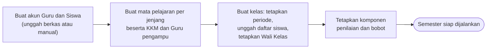
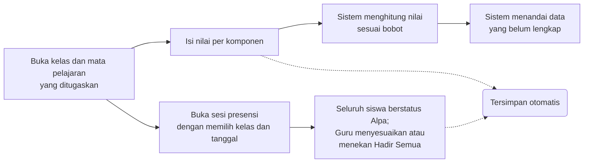
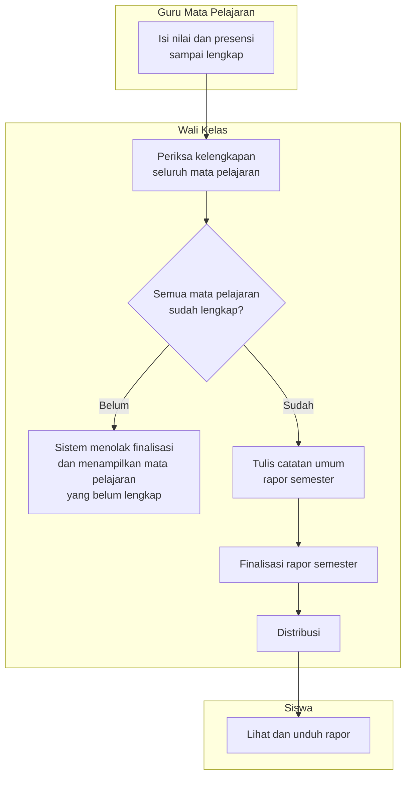
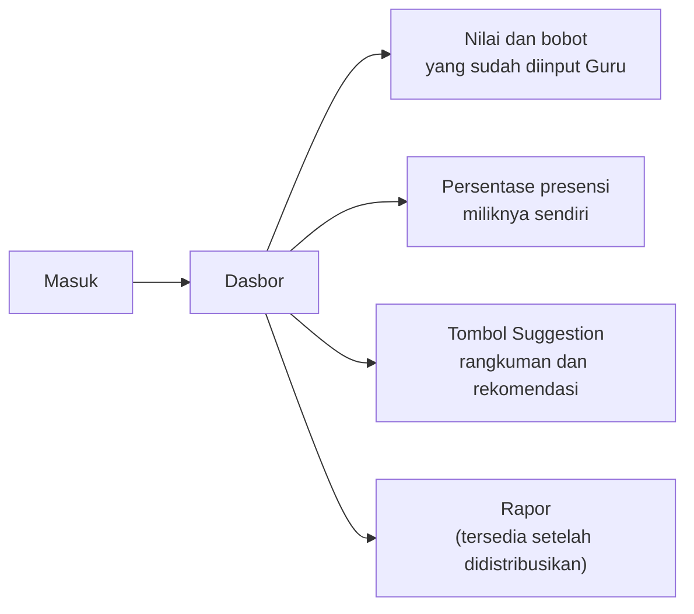
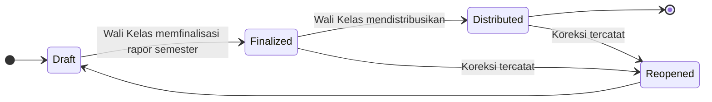

# Product Requirements Document — EduTrack

| Keterangan | Isi |
|---|---|
| **Nama produk** | EduTrack |
| **Project ID** | EDU-2026-001 |
| **Versi** | v2.6 |
| **Tanggal** | 5 Agustus 2026 |
| **Disusun oleh** | Re:Code |
| **Pengguna MVP** | Administrator, Guru (termasuk Guru yang ditugaskan sebagai Wali Kelas), dan Siswa |
| **Kedudukan** | Turunan dari PRD MVP Final, dengan penyesuaian yang tercatat pada §16. Menggantikan seluruh versi PRD.md sebelumnya |

> Dokumen ini menguraikan **apa** yang dibangun beserta alasannya, sepenuhnya dari sisi aplikasi.
> Arsitektur, basis data, antarmuka program, dan pilihan teknologi **tidak dibahas di sini** dan disusun terpisah pada dokumen spesifikasi teknis.
>
> Keputusan pada [§14](#14-hal-yang-harus-divalidasi-dengan-sekolah) wajib dikonfirmasi dengan pihak sekolah sebelum sistem menggunakan data sekolah yang sebenarnya.

---

## Inti Produk

EduTrack membantu sekolah mencatat nilai dan presensi secara teratur, memperlihatkan perkembangan siswa sebelum rapor terbit, kemudian menyatukan seluruh nilai menjadi rapor semester yang dapat dibagikan kepada siswa.

**Lima keputusan produk yang paling menentukan:**

1. Terdapat tiga jenis akun: Administrator, Guru, dan Siswa.
2. Seluruh Guru mengajar mata pelajaran tertentu. Sebagian Guru juga ditetapkan sebagai Wali Kelas.
3. Guru hanya mengelola kelas dan mata pelajaran yang ditugaskan kepadanya.
4. Wali Kelas dapat melihat seluruh nilai mata pelajaran pada kelas walinya, tetapi tidak dapat mengubah nilai milik Guru lain.
5. **Finalisasi rapor semester dilakukan Wali Kelas.** Guru Mata Pelajaran tidak melakukan finalisasi.

---

## 1. Latar Belakang dan Permasalahan

Pada sebagian sekolah, nilai tugas dan ujian baru diketahui secara lengkap ketika rapor telah terbit.

| Pemangku kepentingan | Dampak yang dialami |
|---|---|
| **Siswa dan orang tua** | Tidak mengetahui nilai mana yang rendah, topik mana yang perlu ditingkatkan, bagaimana bobot setiap penilaian, maupun apa yang harus segera diperbaiki selagi waktu masih tersedia |
| **Guru Mata Pelajaran** | Membutuhkan cara yang lebih cepat untuk memeriksa kelengkapan nilai dan presensi seluruh siswa |
| **Wali Kelas** | Perlu menghimpun dan memeriksa kesiapan seluruh mata pelajaran sebelum rapor semester dapat disusun |

### 1.1 Akar permasalahan

Permasalahan utama bukan ketiadaan aplikasi, melainkan **rentang waktu antara pencatatan nilai dan diketahuinya nilai tersebut oleh siswa**. Guru telah memiliki data sejak penilaian pertama, sementara siswa baru mengetahuinya ketika tindakan perbaikan sudah tidak dapat dilakukan.

---

## 2. Solusi yang Ditawarkan

EduTrack menyediakan satu aplikasi web yang:

- memberi siswa akses terhadap nilai, bobot penilaian, presensi, dan rekomendasi belajar miliknya sendiri;
- membantu Guru Mata Pelajaran mencatat nilai dan presensi serta memantau perkembangan siswa;
- membantu Wali Kelas memeriksa kesiapan seluruh mata pelajaran, memfinalisasi rapor semester, dan mendistribusikannya.

---

## 3. Tujuan Produk

| # | Tujuan |
|---|---|
| G1 | Membuat nilai, bobot penilaian, dan pencatatan presensi lebih transparan |
| G2 | Mengurangi pekerjaan rekapitulasi manual pada saat penyusunan rapor |
| G3 | Memungkinkan siswa mengetahui kekurangannya pada nilai tertentu dan memperoleh rekomendasi belajar yang mudah dipahami |

---

## 4. Batas MVP

MVP adalah versi awal yang hanya memuat fungsi paling penting agar alur sekolah dapat diuji dari awal sampai akhir.

### 4.1 Masuk MVP

| # | Cakupan |
|---|---|
| M1 | Pembuatan akun Guru dan Siswa melalui **unggah berkas CSV atau pengisian manual**, dengan **kata sandi awal dibuat sistem**. **Sesi kelas dibuka Guru Mata Pelajaran** pada saat mencatat presensi |
| M2 | Administrator menugaskan Kelas, Siswa, Guru, Mata Pelajaran, Semester, dan Tahun Ajaran. **Mata pelajaran dibuat per jenjang** — misalnya Matematika X, Biologi XI — dan penugasan berlangsung dalam tiga lapis sebagaimana diuraikan pada [§8.2](#82-struktur-mata-pelajaran-dan-penugasan) |
| M3 | Administrator menetapkan **KKM per mata pelajaran-jenjang** pada saat mata pelajaran dibuat. Komponen penilaian dan bobot memakai **templat bawaan sistem** yang berlaku untuk seluruh mata pelajaran ([§8.3](#83-komponen-penilaian-bobot-dan-kkm)) |
| M4 | **Guru Mata Pelajaran** membuka sesi presensi serta menginput nilai dan presensi siswa |
| M5 | **Wali Kelas** memfinalisasi rapor, mendistribusikan rapor, serta mengunduh nilai dan rapor |
| M6 | AI Insight untuk siswa |
| M7 | Pembobotan penilaian **hanya untuk ranah Pengetahuan** |
| M8 | **Unggah berkas** untuk akun Guru dan Siswa (CSV) serta daftar siswa per kelas (Excel), disertai templat yang dapat diunduh |
| M9 | **Pemberitahuan berhasil atau gagal** pada setiap proses administrasi |

### 4.2 Belum Masuk MVP

| # | Di luar cakupan | Keterangan |
|---|---|---|
| NG1 | Portal khusus orang tua | Orang tua mengakses melalui akun siswa |
| NG2 | Integrasi dengan aplikasi sekolah lain | Tidak ada pertukaran data dengan sistem pihak ketiga |
| NG3 | Banyak pilihan templat rapor | Hanya tersedia satu format |
| NG4 | Prediksi kelulusan atau keputusan otomatis | Bertentangan dengan batasan AI pada §8.6 |
| NG5 | Aplikasi mobile Android/iOS | Antarmuka web, tetap wajib terbaca pada perangkat bergerak |
| NG6 | RPS atau modul rencana pembelajaran | — |
| NG7 | AI Learning Coach untuk membuat latihan soal | — |
| NG8 | Kenaikan kelas | Perpindahan tahun ajaran belum ditangani sistem |
| NG9 | Riwayat nilai jenjang sebelumnya | Sistem hanya menyajikan periode berjalan |
| NG10 | Pembobotan dinamis per mata pelajaran | Komponen dan bobot mengikuti ketetapan Administrator |
| NG11 | **Penilaian Keterampilan, Sikap Sosial, dan Sikap Spiritual** | MVP hanya menangani ranah Pengetahuan |
| NG12 | **Umpan balik atau tindak lanjut presensi pada halaman presensi** | Halaman presensi hanya menampilkan persentase, tanpa peringatan maupun anjuran. AI Insight tetap boleh menyebut presensi sebagai konteks penjelas ([§8.5](#85-ai-insight--tombol-suggestion)) |
| NG14 | **Penyimpanan riwayat rekomendasi AI** | Keluaran bersifat sementara dan tidak tersimpan |
| NG15 | **Jadwal mengajar** | Sistem tidak mengetahui pertemuan yang seharusnya terjadi. Sesi dibuka Guru secara manual, tanpa jumlah minimum |
| NG16 | **Ambang kehadiran minimum** | Tidak ada batas persentase yang ditetapkan sekolah di dalam sistem |
| NG17 | **Unggah dokumen pendukung izin** | Status Izin dan Sakit dicatat tanpa surat, berkas, maupun lampiran bukti |

---

## 5. Pengguna dan Peran

| Peran | Jenis | Cakupan kerja | Terhadap nilai akademik |
|---|---|---|---|
| **Administrator** | Jenis akun | Seluruh sekolah | **Akses penuh**, termasuk mengisi dan mengubah nilai |
| **Guru Mata Pelajaran** | Jenis akun | Kelas dan mata pelajaran yang ditugaskan kepadanya | Mengisi dan menyunting, terbatas pada penugasannya |
| **Wali Kelas** | **Kewenangan tambahan** pada akun Guru | Satu kelas asuhan, seluruh mata pelajaran | Hanya membaca; tidak dapat mengubah nilai Guru lain |
| **Siswa** | Jenis akun | Dirinya sendiri | Hanya membaca |

Seluruh Guru merupakan Guru Mata Pelajaran. Wali Kelas bukan jenis akun baru, melainkan kewenangan tambahan yang diberikan Administrator kepada Guru tertentu. Satu orang dapat memegang kedua fungsi tersebut sekaligus.

### 5.1 Administrator

Administrator menyiapkan data dan aturan sekolah, serta memiliki akses penuh terhadap seluruh data termasuk nilai akademik.

1. Membuat akun Guru dan Siswa melalui unggah berkas atau pengisian manual, dengan kata sandi awal yang dibuat sistem ([§6.1.1](#611-pembuatan-akun-guru) dan [§6.1.2](#612-pembuatan-akun-siswa))
2. Membuat mata pelajaran per jenjang beserta KKM, dan menghubungkannya dengan Guru pengampu ([§6.1.4](#614-pembuatan-mata-pelajaran))
3. Membuat kelas beserta periode akademiknya, mengunggah daftar siswa, menghubungkan Guru mata pelajaran, dan menetapkan Wali Kelas ([§6.1.5](#615-pembuatan-kelas))
4. Menetapkan komponen penilaian dan bobot
5. Mengisi dan mengubah nilai akademik apabila diperlukan

### 5.2 Guru Mata Pelajaran

Guru hanya dapat bekerja pada kelas dan mata pelajaran yang diberikan oleh Administrator.

1. Mengisi dan menyunting nilai
2. Membuka sesi presensi, menetapkan dan menyunting status kehadiran, serta menghapus sesi yang keliru
3. Melihat progres siswa pada penugasannya
5. **Tidak melakukan finalisasi rapor**

### 5.3 Wali Kelas

Wali Kelas merupakan kewenangan tambahan pada akun Guru.

1. Melihat nilai seluruh mata pelajaran milik siswa di kelas walinya
2. Memeriksa apakah seluruh Guru telah menginput semua nilai
3. Menulis atau menyunting catatan umum rapor semester
4. Memfinalisasi rapor semester setelah seluruh mata pelajaran lengkap
5. Mendistribusikan rapor kepada siswa
6. Mengunduh nilai dan rapor
7. **Tidak dapat mengubah nilai yang dibuat oleh Guru Mata Pelajaran lain**

### 5.4 Siswa

1. Melihat nilai dan bobot penilaian segera setelah Guru menginputnya
2. Melihat persentase presensi miliknya sendiri
3. Memperoleh rangkuman dan rekomendasi belajar melalui tombol Suggestion
4. Melihat dan mengunduh rapor setelah Wali Kelas mendistribusikannya

---

## 6. Alur Kerja Utama

> Setiap alur disajikan dalam dua bentuk yang menggambarkan hal yang sama:
> **gambar** untuk pembacaan manusia, dan **blok Mermaid** untuk pemrosesan otomatis
> serta perenderan pada GitHub, VS Code, dan Notion.

### 6.1 Persiapan semester — Administrator



#### 6.1.1 Pembuatan akun Guru

1. Administrator mengunggah berkas CSV atau mengisi manual. Isi data hanya **Nama** dan **NIP**
2. Sistem membuat **kata sandi awal secara otomatis** untuk setiap Guru
3. Guru masuk aplikasi menggunakan **NIP dan kata sandi**
4. Guru **belum memiliki peran apa pun** sampai dihubungkan dengan mata pelajaran

#### 6.1.2 Pembuatan akun Siswa

1. Administrator mengunggah berkas CSV atau mengisi manual. Isi data hanya **Nama** dan **NIS**
2. Sistem membuat **kata sandi awal secara otomatis** untuk setiap Siswa
3. Siswa masuk aplikasi menggunakan **NIS dan kata sandi**
4. Siswa **belum berada di kelas mana pun** sampai kelas dibuat

#### 6.1.3 Kata sandi awal

Kata sandi dibuat sistem untuk setiap akun Guru dan Siswa, lalu ditampilkan kepada Administrator agar dapat diserahkan kepada pengguna yang bersangkutan. **Tidak ada syarat kerumitan kata sandi** dan tidak ada kewajiban penggantian pada masuk pertama.

#### 6.1.4 Pembuatan mata pelajaran

1. Dibuat manual, memuat **nama mata pelajaran, jenjang, KKM, dan Guru pengampu** yang dipilih dari daftar
2. Satu mata pelajaran memiliki **tepat satu jenjang dan satu Guru pengampu**, dan satu Guru hanya mengampu satu mata pelajaran pada satu jenjang
3. Setelah dihubungkan, Guru memperoleh peran mengajar, misalnya Matematika X

#### 6.1.5 Pembuatan kelas

1. Administrator menekan tombol buat kelas baru
2. Menetapkan **periode akademik**: semester dan tahun ajaran dipilih dari daftar. Proses dapat dibatalkan atau dilanjutkan
3. Apabila dilanjutkan, Administrator **mengunggah daftar siswa** dalam berkas Excel. Templat dapat diunduh apabila belum tersedia; isi templat adalah **Kelas, NIS, dan Nama siswa**. **NIS menjadi kunci pencocokan** dengan akun siswa yang sudah ada; nama hanya dipakai sebagai pemeriksaan
4. Administrator **menghubungkan Guru mata pelajaran** dengan kelas tersebut. Guru yang jenjang mata pelajarannya tidak sama dengan jenjang kelas akan ditolak
5. Administrator menetapkan salah satu Guru sebagai **Wali Kelas**
6. Guru tersebut memperoleh kewenangan tambahan Wali Kelas
7. **Satu proses menghasilkan satu kelas.** Pembuatan kelas berikutnya mengulang proses dari awal

#### 6.1.6 Umpan balik proses

Seluruh proses pada [§6.1](#61-persiapan-semester--administrator) — unggah berkas, pembuatan akun, penetapan peran, dan pembuatan kelas — **wajib menampilkan pemberitahuan berhasil atau gagal**. Pemberitahuan kegagalan menyebutkan alasannya, misalnya baris berkas yang tidak terbaca atau data yang tidak lengkap.

### 6.2 Pencatatan nilai dan presensi — Guru Mata Pelajaran




### 6.3 Finalisasi dan distribusi rapor — Wali Kelas

Finalisasi dilakukan **satu kali**, oleh Wali Kelas, setelah seluruh mata pelajaran pada kelas asuhannya lengkap.

**Penanda data belum lengkap.** Kelengkapan data hanya diberitahukan **pada saat finalisasi rapor**. Apabila masih terdapat mata pelajaran yang belum lengkap, sistem menolak finalisasi dan menampilkan pesan berikut untuk setiap mata pelajaran tersebut:

> Data Mapel *&lt;nama mata pelajaran&gt;* belum ada, tolong hubungi guru yang bertanggung jawab.

Di luar momen finalisasi, sistem **tidak** menampilkan pemberitahuan kelengkapan data dalam bentuk apa pun.



> **Catatan:** diagram gambar untuk §6.1 dan §6.3 belum tersedia karena layanan pembuatan gambar sedang tidak dapat diakses. Blok Mermaid di atas bersifat lengkap dan dapat langsung dipakai.

### 6.4 Akses nilai — Siswa




---

## 7. Fitur Wajib MVP

| Bagian | Fitur yang wajib tersedia |
|---|---|
| **Administrasi** | Pembuatan akun melalui unggah CSV atau manual dengan kata sandi otomatis, mata pelajaran per jenjang beserta KKM dan Guru pengampu, pembuatan kelas beserta periode akademik dan unggah daftar siswa, templat berkas yang dapat diunduh, penetapan Wali Kelas, pemeriksaan kecocokan jenjang, komponen penilaian, bobot, serta pemberitahuan berhasil atau gagal |
| **Nilai** | Input dan edit manual, komponen dan bobot, perhitungan nilai, serta tampilan nilai bagi siswa |
| **Presensi** | Pembukaan dan penghapusan sesi, pencatatan status hadir/izin/sakit/alpa per sesi, tombol **Hadir Semua**, penyuntingan, dan **persentase kehadiran** |
| **Rapor Semester** | Nilai dari seluruh mata pelajaran, catatan Wali Kelas, finalisasi, pembuatan berkas rapor, distribusi, dan unduh |
| **AI Insight** | Tombol Suggestion berisi rangkuman capaian dan rekomendasi belajar untuk siswa |

---

## 8. Kemampuan Sistem

### 8.1 Matriks kewenangan

| Kemampuan | Administrator | Guru Mapel | Wali Kelas | Siswa |
|---|:--:|:--:|:--:|:--:|
| Membuat tahun ajaran, semester, kelas, mata pelajaran | ✅ | – | – | – |
| Membuat dan mengelola akun Guru dan Siswa | ✅ | – | – | – |
| Menempatkan siswa ke kelas | ✅ | – | – | – |
| Membuat mata pelajaran per jenjang dan menghubungkannya dengan Guru lalu kelas | ✅ | – | – | – |
| Menetapkan Wali Kelas | ✅ | – | – | – |
| Menetapkan KKM per mata pelajaran-jenjang, komponen penilaian, dan bobot | ✅ | – | – | – |
| **Mengisi dan mengubah nilai akademik** | ✅ **penuh** | ✅ penugasannya | ❌ | ❌ |
| **Membuka dan menghapus sesi presensi** | ✅ | ✅ penugasannya | ❌ | ❌ |
| Mengisi dan menyunting presensi | ✅ | ✅ penugasannya | ❌ | ❌ |
| Melihat nilai lintas mata pelajaran | ✅ | ❌ | ✅ kelas walinya | ✅ dirinya |
| Menulis catatan umum rapor semester | ✅ | ❌ | ✅ | – |
| **Memfinalisasi rapor semester** | ✅ | ❌ | ✅ | – |
| Mendistribusikan rapor | ✅ | ❌ | ✅ | – |
| Mengunduh nilai dan rapor | ✅ | ✅ penugasannya | ✅ kelas walinya | ✅ setelah distribusi |
| Menggunakan tombol Suggestion | ❌ | ❌ | ❌ | ✅ dirinya |
| Melihat riwayat aktivitas | ✅ | – | – | – |

### 8.2 Struktur mata pelajaran dan penugasan

Penugasan disusun dalam tiga lapis. Setiap lapis menjadi dasar bagi lapis berikutnya.

| Lapis | Yang dihubungkan | Contoh |
|:--:|---|---|
| 1 | Mata pelajaran dibuat **per jenjang** | Biologi X, Matematika XI |
| 2 | Mata pelajaran-jenjang dihubungkan dengan **satu Guru** | Pak Cahyo — Biologi X; Bu Fifi — Matematika XI |
| 3 | **Kelas** dihubungkan dengan Guru pada saat kelas dibuat | Kelas X IPA 3 — Pak Cahyo; Kelas XI IPS 2 — Bu Fifi |

Mata pelajaran **tidak dipilih ulang pada lapis ketiga**. Kelas X IPA 3 yang dihubungkan dengan Pak Cahyo otomatis memperoleh Biologi X, karena mata pelajaran tersebut sudah melekat pada Pak Cahyo sejak lapis kedua. Penghubungan ini dilakukan pada langkah pembuatan kelas ([§6.1.5](#615-pembuatan-kelas)).

**Pemeriksaan kecocokan jenjang**

Sistem menolak penghubungan apabila jenjang kelas berbeda dengan jenjang mata pelajaran Guru. Kelas X tidak dapat dihubungkan dengan Guru yang mengampu mata pelajaran berjenjang XI. Penolakan disertai pesan yang menyebutkan jenjang kelas dan jenjang mata pelajaran yang tidak cocok.

**Ketentuan penugasan**

1. Satu mata pelajaran memiliki **tepat satu jenjang dan tepat satu Guru pengampu**. Guru dipilih pada saat mata pelajaran dibuat ([§6.1.4](#614-pembuatan-mata-pelajaran)).
2. Satu Guru mengampu **tepat satu mata pelajaran pada tepat satu jenjang**. Guru tidak dapat mengampu dua mata pelajaran yang berbeda, dan tidak dapat mengampu jenjang yang berbeda.
3. Satu Guru **boleh mengajar lebih dari satu kelas**, sepanjang seluruh kelas tersebut berada pada jenjang yang sama.
4. Karena Guru hanya mengampu satu mata pelajaran pada satu jenjang, **mata pelajaran tidak pernah perlu dipilih**. Kelas sudah cukup untuk menentukan lingkup pengisian nilai maupun sesi presensi.
5. Guru hanya melihat dan mengisi data pada kelas yang dihubungkan kepadanya, sehingga tidak mungkin memasukkan nilai siswa yang tidak diajarnya.

**KKM** ditetapkan Administrator pada lapis pertama, yaitu bersamaan dengan pembuatan mata pelajaran. Biologi X dan Biologi XI dapat memiliki KKM yang berbeda.

### 8.3 Komponen penilaian, bobot, dan KKM

Sistem menyediakan **templat komponen penilaian dan bobot bawaan** yang berlaku untuk seluruh mata pelajaran. Administrator tidak perlu menyusunnya dari nol.

**Templat bawaan**

| Komponen | Bobot per komponen | Jumlah |
|---|--:|--:|
| T1, T2, T3 | 6% | 18% |
| U1, U2, U3 | 10% | 30% |
| UTS | 26% | 26% |
| UAS | 26% | 26% |
| **Total** | | **100%** |

Susunan ini mengikuti ketentuan bahwa UTS dan UAS berbobot sama dan lebih besar daripada ulangan harian, sedangkan ulangan harian lebih besar daripada tugas. Templat berlaku **sama untuk seluruh mata pelajaran**; pembobotan yang berbeda per mata pelajaran berada di luar cakupan MVP (NG10). Angka templat masih perlu divalidasi sekolah (V1).

```
Nilai akhir mata pelajaran = Σ (nilai komponen × bobot komponen) ÷ 100
```

| Ketentuan | |
|---|---|
| Ranah penilaian | **Hanya Pengetahuan.** Keterampilan, Sikap Sosial, dan Sikap Spiritual di luar cakupan MVP |
| Bobot | Mengikuti templat bawaan dan berlaku untuk seluruh mata pelajaran. **Jumlah seluruh bobot harus tepat 100%** |
| KKM | Batas acuan ketuntasan, ditetapkan **per mata pelajaran-jenjang**. **Nilai awal 75**, mengikuti ketentuan yang lazim digunakan sekolah di Indonesia, dan **dapat diubah Administrator** |
| Nilai kosong | **Tidak boleh dianggap sebagai nilai nol.** Sistem menandainya sebagai belum lengkap |
| Nilai final | Tidak ditampilkan sebagai hasil final selama data belum lengkap |

### 8.4 Presensi

Presensi dicatat melalui **sesi**. Sesi adalah satu pertemuan pada satu kelas, satu mata pelajaran, dan satu tanggal.

**Alur pembukaan sesi**

1. Guru membuka halaman presensi, lalu memilih **kelas** dan **tanggal**
2. Mata pelajaran tidak perlu dipilih. Karena Guru hanya mengampu satu mata pelajaran, sesi otomatis melekat pada mata pelajaran tersebut ([§8.2](#82-struktur-mata-pelajaran-dan-penugasan))
3. Sesi terbuka dan seluruh siswa kelas itu langsung memperoleh status **Alpa**
4. Guru menyesuaikan status yang perlu diubah, atau menekan tombol **Hadir Semua** lalu menandai siswa yang tidak hadir
5. Perubahan tersimpan otomatis

Sesi **tidak perlu ditutup**. Tidak terdapat status selesai maupun penguncian sesi. Sesi yang keliru — misalnya salah memilih kelas — **dihapus** oleh Guru yang membukanya.

| Pelaku | Yang dapat dilakukan | Batas kewenangan |
|---|---|---|
| **Administrator** | Membuka, menyunting, dan menghapus seluruh sesi beserta presensinya | — |
| **Guru Mapel** | Membuka sesi, menetapkan status Hadir/Izin/Sakit/Alpa, menekan Hadir Semua, menambah catatan, menyunting, dan menghapus sesi | Hanya untuk kelas dan mata pelajaran yang diajarnya |
| **Wali Kelas** | Melihat ringkasan presensi seluruh siswa pada kelas walinya | Tidak membuka, mengubah, maupun menghapus sesi Guru lain |
| **Siswa** | Melihat persentase presensi miliknya sendiri per mata pelajaran | Tidak dapat membuka rincian presensi per tanggal, maupun presensi siswa lain |

**Ketentuan presensi:**

1. Satu Guru, satu kelas, dan satu tanggal hanya boleh memiliki **satu sesi**. Dua Guru mata pelajaran berbeda dapat membuka sesi pada kelas dan tanggal yang sama tanpa saling bertabrakan, karena sesi melekat pada Guru yang membukanya
2. Setiap siswa memiliki tepat satu status pada satu sesi. **Status kosong tidak mungkin terjadi**, karena sesi selalu terbuka dengan seluruh siswa berstatus Alpa
3. Koreksi presensi wajib tercatat: nilai lama, nilai baru, pengguna, waktu, dan alasan
4. Penghapusan sesi wajib tercatat dan menghapus seluruh status di dalamnya. Persentase kehadiran menyesuaikan secara otomatis
5. **Sistem hanya menampilkan persentase kehadiran.** Tidak terdapat peringatan, anjuran, maupun tindak lanjut apa pun berdasarkan angka tersebut

**Perhitungan persentase kehadiran**

```
Persentase kehadiran = jumlah sesi berstatus Hadir, Izin, atau Sakit
                       ÷ jumlah sesi yang dibuka Guru × 100%
```

**Izin dan Sakit dihitung sebagai kehadiran.** Hanya status Alpa yang mengurangi persentase.

Persentase dihitung **per mata pelajaran**, karena penyebutnya adalah jumlah sesi yang dibuka Guru mata pelajaran tersebut. Tidak terdapat jumlah sesi minimum dan tidak terdapat ambang kehadiran minimum. Pertemuan yang sesinya tidak pernah dibuka tidak diketahui sistem sehingga tidak memengaruhi perhitungan.

### 8.5 AI Insight — tombol Suggestion

AI digunakan sebagai alat bantu peringkasan dan rekomendasi belajar, **hanya untuk Siswa**.

**Cara kerja**

Fitur dijalankan melalui tombol **Suggestion** pada halaman siswa. Ketika tombol ditekan:

1. Sistem menghimpun seluruh data akademik siswa tersebut pada semester berjalan — nilai setiap mata pelajaran beserta topiknya, KKM, kelengkapan penilaian, dan **persentase kehadiran per mata pelajaran**
2. AI berperan sebagai **konsultan pendidikan** dan menyusun rangkuman capaian beserta rekomendasi hal yang perlu ditingkatkan
3. Hasil ditampilkan dalam format percakapan yang terstruktur
4. AI **tidak mengubah data sumber apa pun**

| Pelaku | Data yang dibaca | Yang ditampilkan |
|---|---|---|
| **Siswa** | Seluruh nilai mata pelajaran beserta topiknya pada semester berjalan, KKM, kelengkapan penilaian, dan persentase kehadiran per mata pelajaran — **hanya milik siswa yang bersangkutan** | Rangkuman capaian dan rekomendasi hal yang perlu ditingkatkan |

Presensi dipakai AI **sebagai fakta penjelas**, bukan sebagai peringatan. Misalnya, nilai Matematika yang rendah dapat dikaitkan dengan kehadiran Matematika yang rendah sebagai kemungkinan penyebab. Halaman presensi itu sendiri tetap tidak menampilkan peringatan maupun anjuran (P16).

**Ketentuan keluaran**

| Aspek | Ketentuan |
|---|---|
| Pemicu | Tombol **Suggestion**. Tidak berjalan otomatis |
| Interaksi | **Sekali jalan.** Tidak ada pertanyaan lanjutan dan tidak ada kolom masukan dari siswa |
| Format | Percakapan yang terstruktur |
| Susunan jawaban | **Tidak distandarkan.** AI bebas menyusun isi sepanjang relevan dengan data yang diberikan |
| Bahasa | **Profesional**, sebagaimana seorang konsultan pendidikan |
| Penyimpanan | **Tidak disimpan.** Hasil hilang ketika halaman dimuat ulang; menekan tombol kembali menghasilkan keluaran baru |

Karena susunan jawaban tidak distandarkan, **fakta sumber, periode data, dan penanda Data Sementara ditampilkan oleh halaman** di sekitar keluaran AI, bukan dituntut menjadi bagian dari teks AI.

Karena keluaran tidak disimpan, tidak tersedia riwayat rekomendasi yang pernah ditampilkan kepada siswa. Konsekuensi ini diterima secara sadar untuk MVP.

### 8.6 Larangan bagi AI

1. Tidak menghitung atau menentukan nilai resmi
2. Tidak mengubah KKM, bobot, nilai, atau presensi
3. Tidak memfinalisasi atau mendistribusikan rapor
4. Tidak membuat prediksi kelulusan, diagnosis psikologis, atau keputusan sanksi
5. Tidak menampilkan rata-rata final apabila data belum lengkap
6. Tidak membaca data siswa selain siswa yang menekan tombol
7. Kegagalan layanan AI tidak menghambat input nilai, presensi, finalisasi, maupun distribusi rapor

---

## 9. Status Nilai dan Rapor

Penyimpanan bersifat otomatis selama data berstatus Draft.

| Status | Arti | Dapat dilihat Siswa? |
|---|---|---|
| **Draft** | Masih dikerjakan dan dapat diperbaiki oleh Guru | **Ya**, setiap nilai terlihat siswa segera setelah diinput |
| **Finalized** | Seluruh mata pelajaran telah diperiksa dan rapor semester dikunci oleh Wali Kelas | Belum, sampai didistribusikan |
| **Distributed** | Rapor resmi telah dibagikan oleh Wali Kelas | Ya |
| **Reopened** | Data final dibuka kembali untuk koreksi yang tercatat | Sesuai kebijakan sekolah |



### Mengapa finalisasi penting

Finalisasi mencegah nilai berubah tanpa sepengetahuan pihak terkait setelah rapor disusun. Apabila koreksi diperlukan, sistem menyimpan alasan, pengguna yang melakukan perubahan, waktu, dan versi rapor baru.

---

## 10. Aturan Produk

| # | Aturan |
|---|---|
| P1 | Seluruh Guru merupakan Guru Mata Pelajaran. Kewenangan Wali Kelas hanya tambahan pada Guru tertentu |
| P2 | Mata pelajaran dibuat per jenjang dengan tepat satu Guru pengampu. Satu Guru mengampu tepat satu mata pelajaran pada tepat satu jenjang, tetapi boleh mengajar banyak kelas pada jenjang tersebut. Sistem menolak penghubungan kelas apabila jenjang kelas tidak sama dengan jenjang mata pelajaran Guru |
| P3 | Satu kelas hanya memiliki satu Wali Kelas aktif dalam satu semester |
| P4 | Administrator menetapkan KKM per mata pelajaran-jenjang, serta komponen penilaian dan bobot; jumlah seluruh bobot harus tepat 100% |
| P5 | Nilai kosong tidak boleh dianggap sebagai nilai nol; sistem menandainya sebagai belum lengkap |
| P6 | Presensi hanya dicatat melalui sesi. Satu kelas, mata pelajaran, dan tanggal hanya memiliki satu sesi, dan setiap siswa memiliki tepat satu status pada sesi tersebut dengan status awal Alpa |
| P7 | Koreksi presensi dan penghapusan sesi harus tercatat, dan hanya dapat dilakukan pada lingkup penugasan Guru |
| P8 | Guru Mata Pelajaran hanya dapat melihat dan mengubah nilai pada penugasannya sendiri |
| P9 | **Finalisasi rapor semester hanya dilakukan Wali Kelas.** Guru Mata Pelajaran tidak melakukan finalisasi |
| P10 | Wali Kelas tidak dapat mengubah nilai Guru lain; Wali Kelas hanya dapat meminta koreksi |
| P11 | Rapor semester tidak dapat difinalisasi sebelum seluruh mata pelajaran pada kelas tersebut lengkap |
| P12 | Siswa hanya dapat melihat datanya sendiri dan hanya dapat membuka rapor yang sudah didistribusikan |
| P13 | Setelah finalisasi, koreksi harus melalui proses buka kembali dengan alasan dan riwayat perubahan. **Pembukaan kembali dilakukan Administrator** |
| P14 | **Administrator memiliki akses penuh terhadap seluruh data, termasuk nilai akademik.** Setiap perubahan oleh Administrator tetap tercatat pada riwayat aktivitas |
| P15 | AI hanya membaca data milik siswa yang bersangkutan dan tidak menulis ke data akademik |
| P16 | Presensi hanya disajikan sebagai persentase kehadiran terhadap jumlah sesi yang dibuka Guru, tanpa ambang minimum, peringatan, maupun anjuran. Izin dan Sakit dihitung sebagai kehadiran |
| P17 | Akun Guru dan Siswa dibuat dengan kata sandi awal yang dihasilkan sistem. Guru tidak memiliki peran apa pun sampai dihubungkan dengan mata pelajaran, dan Siswa tidak berada di kelas mana pun sampai kelas dibuat |
| P18 | Satu proses pembuatan kelas menghasilkan tepat satu kelas, dan setiap proses administrasi menampilkan pemberitahuan berhasil atau gagal |
| P19 | Satu tahun ajaran hanya memiliki **satu semester aktif** pada satu waktu |
| P20 | Guru masuk aplikasi menggunakan NIP, Siswa menggunakan NIS, keduanya dengan kata sandi awal yang dibuat sistem |

---

## 11. Use Case Utama

| ID | Pelaku | Kegiatan | Berhasil apabila |
|---|---|---|---|
| UC-01 | Semua pengguna | Masuk dan keluar aplikasi | Pengguna hanya melihat menu sesuai kewenangannya |
| UC-02 | Administrator | Membuat kelas beserta periode akademik dan unggah daftar siswa | Satu kelas terbentuk, siswa termuat, dan Wali Kelas tertetapkan |
| UC-03 | Administrator | Membuat akun Guru dan Siswa melalui unggah CSV atau manual | Akun unik dan aktif, kata sandi awal terbentuk otomatis, dan hasil proses diberitahukan |
| UC-04 | Administrator | Menghubungkan Guru ke mata pelajaran-jenjang lalu kelas ke Guru, menempatkan Siswa, menetapkan Wali Kelas | Kelas memperoleh mata pelajaran secara otomatis, dan penghubungan dengan jenjang yang tidak cocok ditolak |
| UC-05 | Administrator | Menetapkan KKM per mata pelajaran-jenjang, komponen penilaian, dan bobot | KKM valid dan jumlah bobot sama dengan 100% |
| UC-06 | Administrator | Mengoreksi nilai akademik | Perubahan tersimpan dan tercatat pada riwayat aktivitas |
| UC-07 | Guru Mapel | Mengisi nilai | Nilai tersimpan pada kelas dan mata pelajaran tugas Guru |
| UC-08 | Guru Mapel | Membuka sesi presensi lalu menetapkan status | Seluruh siswa memperoleh tepat satu status sejak sesi terbuka, dan sesi yang keliru dapat dihapus |
| UC-09 | Guru Mapel | Menginput nilai yang langsung terlihat siswa | Nilai tampil pada halaman siswa yang bersangkutan tanpa langkah publikasi |
| UC-10 | Wali Kelas | Melihat seluruh nilai mata pelajaran kelas walinya | Semua mata pelajaran terlihat tanpa izin mengubah nilai Guru lain |
| UC-11 | Wali Kelas | Memeriksa kelengkapan seluruh mata pelajaran | Mata pelajaran yang belum lengkap ditampilkan secara jelas |
| UC-12 | Wali Kelas | Memfinalisasi rapor semester | Berhasil hanya apabila seluruh mata pelajaran sudah lengkap |
| UC-13 | Wali Kelas | Mendistribusikan rapor | Status dan waktu distribusi tercatat |
| UC-14 | Siswa | Melihat nilai dan presensi sendiri | Data siswa lain tidak dapat dibuka |
| UC-15 | Siswa | Menekan tombol Suggestion | Keluaran disusun dari seluruh data semester berjalan miliknya, memakai bahasa profesional, dan tidak tersimpan setelah halaman dimuat ulang |
| UC-16 | Siswa | Melihat dan mengunduh rapor | Rapor hanya tersedia setelah didistribusikan |

> **Penomoran:** identitas UC pada dokumen ini **tidak sama** dengan baseline. UC-06 baseline adalah *Guru mengisi nilai*, sedangkan UC-06 di sini adalah *Administrator mengoreksi nilai*. Dokumen turunan seperti Test Case dan UAT wajib merujuk penomoran dokumen ini, bukan baseline.
>
> **Prinsip use case:** setiap kegiatan harus memiliki pelaku yang jelas, batas akses yang jelas, hasil yang dapat diperiksa, dan pesan kesalahan yang dapat dipahami apabila proses tidak dapat dilanjutkan.

---

## 12. Layar Minimum

| Pengguna | Layar yang wajib tersedia |
|---|---|
| **Semua** | Masuk, ganti dan atur ulang kata sandi, profil, serta halaman akses ditolak |
| **Administrator** | Dasbor, pembuatan akun beserta unggah berkas dan unduh templat, mata pelajaran per jenjang beserta KKM dan Guru pengampu, pembuatan kelas beserta periode akademik dan unggah daftar siswa, penetapan Wali Kelas, komponen penilaian, bobot, pengelolaan nilai, dan riwayat aktivitas |
| **Guru Mapel** | Dasbor tugas, daftar siswa, nilai, daftar dan pembukaan sesi presensi, pengisian status per sesi, dan ringkasan presensi |
| **Wali Kelas** | Dasbor kelas wali, ringkasan presensi kelas, kesiapan setiap mata pelajaran, catatan rapor, finalisasi, distribusi, dan unduh |
| **Siswa** | Dasbor, nilai dan bobot, persentase presensi sendiri per mata pelajaran, tombol Suggestion, serta rapor |

---

## 13. Kriteria Aplikasi Dianggap Siap

| ID | Kriteria |
|---|---|
| AC-01 | Administrator dapat menyiapkan satu semester lengkap tanpa data ganda maupun penugasan yang keliru |
| AC-02 | Kelas memperoleh mata pelajaran secara otomatis dari Guru yang dihubungkan kepadanya, dan Guru hanya melihat penugasannya sendiri |
| AC-03 | Guru tidak dapat membuka kelas atau mata pelajaran yang bukan tugasnya |
| AC-04 | Templat komponen penilaian dan bobot tersedia sejak awal, dan perubahan yang membuat jumlah bobot tidak sama dengan 100% ditolak disertai pesan yang menyebutkan total saat ini |
| AC-05 | Perhitungan nilai sesuai KKM, komponen, dan bobot yang ditetapkan Administrator |
| AC-06 | Nilai kosong ditampilkan sebagai belum lengkap, bukan sebagai nol |
| AC-07 | Sistem menolak finalisasi rapor semester apabila masih terdapat mata pelajaran yang belum lengkap, dan menampilkan pesan "Data Mapel *nama* belum ada, tolong hubungi guru yang bertanggung jawab" untuk setiap mata pelajaran tersebut |
| AC-08 | Guru Mata Pelajaran tidak memiliki jalur apa pun untuk memfinalisasi rapor |
| AC-09 | Wali Kelas dapat melihat seluruh mata pelajaran kelasnya tetapi tidak dapat mengubah nilai Guru lain |
| AC-10 | Siswa tidak dapat membuka data atau rapor siswa lain |
| AC-11 | Sesi yang baru dibuka langsung memuat seluruh siswa kelas dengan status Alpa, tombol Hadir Semua mengubah seluruhnya menjadi Hadir, dan satu sesi tidak memiliki status ganda untuk siswa yang sama |
| AC-12 | Presensi hanya menampilkan persentase kehadiran terhadap jumlah sesi yang dibuka Guru, tanpa peringatan maupun anjuran |
| AC-13 | Rapor yang diterima siswa sama dengan data yang sudah difinalisasi |
| AC-14 | Koreksi setelah finalisasi tercatat lengkap: alasan, pengguna, waktu, dan versi rapor baru |
| AC-15 | Perubahan nilai oleh Administrator tercatat pada riwayat aktivitas |
| AC-16 | Rekomendasi hanya muncul setelah tombol Suggestion ditekan, dan hilang ketika halaman dimuat ulang |
| AC-17 | Data yang dibaca AI hanya milik siswa yang bersangkutan pada semester berjalan, mencakup nilai, KKM, kelengkapan, dan presensi |
| AC-18 | Keluaran AI menggunakan bahasa profesional dan tidak memuat prakiraan kelulusan maupun perbandingan antarsiswa |
| AC-19 | Fakta sumber, periode data, dan penanda Data Sementara tetap terlihat pada halaman meskipun susunan jawaban AI berbeda-beda |
| AC-20 | AI tidak pernah mengubah nilai, presensi, status final, maupun distribusi |
| AC-21 | Kegagalan layanan AI tidak menghambat input nilai, presensi, finalisasi, maupun distribusi |
| AC-22 | KKM bernilai awal 75 dan dapat diubah Administrator |
| AC-24 | Penghubungan kelas dengan Guru yang jenjang mata pelajarannya tidak sesuai ditolak disertai pesan yang menyebutkan kedua jenjang |
| AC-25 | Penghapusan sesi menghapus seluruh status di dalamnya, tercatat pada riwayat aktivitas, dan persentase kehadiran menyesuaikan |
| AC-26 | Unggah CSV maupun Excel yang berhasil sebagian melaporkan baris yang gagal beserta alasannya, dan tidak menyisakan akun atau kelas setengah jadi |
| AC-27 | Setiap proses administrasi menampilkan pemberitahuan berhasil atau gagal, dan pemberitahuan gagal menyebutkan alasannya |
| AC-28 | Guru yang belum dihubungkan dengan mata pelajaran tidak memiliki menu mengajar, dan Siswa yang belum masuk kelas tidak memiliki data akademik |
| AC-29 | Izin dan Sakit terhitung sebagai kehadiran pada persentase presensi, dan hanya Alpa yang menguranginya |
| AC-30 | Siswa hanya melihat persentase presensi per mata pelajaran, tanpa jalur apa pun untuk membuka rincian per tanggal |
| AC-23 | **Kriteria penutup.** Minimal 90% skenario uji pengguna berhasil dan tidak terdapat kesalahan kritis yang masih terbuka |

---

## 14. Hal yang Harus Divalidasi dengan Sekolah

| # | Yang harus divalidasi |
|---|---|
| V1 | Komponen penilaian dan bobot yang benar-benar digunakan |
| V2 | Nilai KKM untuk setiap mata pelajaran-jenjang |
| V3 | Aturan remedial dan cara mengganti nilai setelah remedial |
| V5 | Format rapor resmi sekolah dan data wajib yang harus tercantum |
| V6 | Kebijakan privasi, lama penyimpanan data, pencadangan, dan penggunaan data nyata untuk AI |

---

## 15. Pertanyaan Terbuka

| # | Pertanyaan | Menahan |
|---|---|---|
| Q7 | **"Dua pilihan tindakan yang realistis"** — baseline mensyaratkannya, sedangkan susunan jawaban AI ditetapkan tidak distandarkan. Dokumen ini memperlakukannya sebagai anjuran pada instruksi ke AI, bukan syarat yang divalidasi sistem | Ketentuan keluaran AI |

---

## 16. Penyesuaian terhadap Baseline

Dokumen ini menyimpang dari PRD MVP Final pada beberapa titik berikut. **Perbedaan ini perlu dikembalikan ke penyusun baseline agar dokumen aslinya diperbarui.**

| # | Ketentuan baseline | Ketentuan dokumen ini | Dampak | Status |
|---|---|---|---|---|
| D1 | **Dua tingkat finalisasi**: Guru Mapel memfinalisasi rapor mata pelajaran, Wali Kelas memfinalisasi rapor semester | **Satu tingkat finalisasi**, hanya oleh Wali Kelas, dan hanya setelah seluruh nilai terisi | Status *Finalized Mapel* dihapus. Rapor Mapel tidak lagi menjadi dokumen tersendiri. Aturan P9 dan use case terkait disesuaikan | Dikonfirmasi tim, 5 Agustus 2026 |
| D2 | **Administrator tidak mengisi maupun mengubah nilai akademik**, dan tidak memiliki menu untuk itu | **Administrator memiliki akses penuh terhadap seluruh data**, termasuk mengubah nilai, memfinalisasi, mendistribusikan, dan membuka kembali rapor. Satu-satunya yang tidak dapat diaksesnya adalah AI Insight | Menghapus satu pengaman integritas yang dirancang baseline. Diimbangi dengan pencatatan wajib pada riwayat aktivitas (AC-15) | Dikonfirmasi tim, 5 Agustus 2026 |
| D4 | AI Insight tersedia bagi Guru dan Wali Kelas pada use case §9 dan daftar layar §12 | **Hanya untuk Siswa**. Guru Mata Pelajaran tidak memiliki AI Insight | Bagian baseline yang bertentangan perlu dihapus | Dikonfirmasi tim, 5 Agustus 2026 |
| D5 | Presensi dicatat dengan memilih tanggal, dan presensi kosong ditampilkan sebagai Alpa | Presensi hanya dicatat melalui **sesi** yang dibuka Guru. Seluruh siswa berstatus awal **Alpa** sejak sesi terbuka, sehingga presensi kosong tidak mungkin terjadi | Ketentuan "Belum Dicatat" dihapus. P6, P7, AC-11, dan AC-25 disesuaikan | Dikonfirmasi tim, 5 Agustus 2026 |
| D6 | Administrator menetapkan "KKM dan bobot penilaian standar" | Administrator menetapkan **KKM, komponen penilaian, dan bobot**. KKM bersifat per mata pelajaran-jenjang. Templat komponen belum tersedia | Komponen penilaian sebelumnya tidak disebut sebagai hal yang ditetapkan Administrator | Dikonfirmasi tim, 5 Agustus 2026 |
| D7 | Penugasan Guru terkait dengan "satu kelas, satu mata pelajaran, dan satu semester" | **Struktur tiga lapis**: mata pelajaran per jenjang dengan satu Guru pengampu, lalu kelas dihubungkan ke Guru. Satu Guru mengampu tepat satu mata pelajaran pada tepat satu jenjang, sehingga mata pelajaran tidak pernah perlu dipilih. Satu Guru boleh mengajar banyak kelas pada jenjang tersebut. Jenjang yang tidak cocok ditolak | Model penugasan berubah. §8.2, P2, UC-04, AC-02, dan AC-24 mengikuti struktur ini. Lapis ketiga dilakukan pada saat pembuatan kelas | Baru, 5 Agustus 2026 |
| D9 | Baseline hanya menyebut "input dan edit manual" | **Unggah CSV dan Excel masuk MVP** untuk akun dan daftar siswa kelas, beserta kata sandi awal otomatis dan pemberitahuan hasil proses | M1, M8, M9, §6.1, P17, P18, dan AC-26 sampai AC-28 | Baru, 5 Agustus 2026 |
| D10 | Baseline tidak membatasi ranah penilaian | **Hanya ranah Pengetahuan.** Keterampilan, Sikap Sosial, dan Sikap Spiritual di luar cakupan | M7 dan NG11 | Dikonfirmasi tim, 5 Agustus 2026 |
| D11 | Siswa melihat nilai "yang sudah diinput Guru"; baseline juga memuat status *Published* | **Nilai langsung terlihat Siswa segera setelah Guru menginputnya.** Status *Published* dan seluruh langkah publikasi dihapus | §9, matriks §8.1, §5.2, §5.4, UC-09, dan §12 disesuaikan. Q4 ditutup | Dikonfirmasi tim, 5 Agustus 2026 |
| D12 | Presensi menjadi salah satu fakta AI Insight | **Dipertahankan.** AI membaca persentase kehadiran per mata pelajaran sebagai fakta penjelas, bukan sebagai peringatan | §8.5, AC-17, NG12, dan glosarium | Dikonfirmasi tim, 5 Agustus 2026 |
| D13 | "Pembobotan full template" tercantum sebagai cakupan MVP | **Dipertahankan.** Sistem menyediakan templat komponen dan bobot bawaan yang berlaku untuk seluruh mata pelajaran | M3 diubah, NG13 dihapus, §8.3 memuat templat, Q3 ditutup | Dikonfirmasi tim, 5 Agustus 2026 |
| D14 | Rapor final dibuka kembali "melalui superadmin" tanpa definisi | **Superadmin adalah Administrator sekolah.** Tidak ada jenis akun keempat | P13, V4 ditutup, dan glosarium | Dikonfirmasi tim, 5 Agustus 2026 |
| D15 | Aturan "satu semester aktif per tahun ajaran" ada di baseline tetapi hilang dari PRD.md | **Dikembalikan** sebagai aturan produk | P19 | Dikonfirmasi tim, 5 Agustus 2026 |
| D16 | Fitur AI dipicu tombol bernama "AI insight" | Tombol bernama **Suggestion** | §8.5, §12, dan glosarium | Dikonfirmasi tim, 5 Agustus 2026 |
| D17 | Penomoran use case baseline UC-01 sampai UC-15 | **Penomoran dokumen ini berbeda dan tidak dapat dipetakan satu lawan satu** | Peringatan penomoran ditambahkan pada §11; dokumen turunan wajib merujuk dokumen ini | Baru, 5 Agustus 2026 |
| D18 | Siswa melihat "daftar dan ringkasan presensi" miliknya | Siswa **hanya melihat persentase kehadiran per mata pelajaran**, tanpa rincian per tanggal | §8.4, §12, dan AC-30 | Dikonfirmasi tim, 5 Agustus 2026 |
| D19 | Baseline menyebut "notifikasi data belum lengkap" tanpa bentuk maupun cakupan | Kelengkapan data **hanya diberitahukan pada saat finalisasi rapor**, berupa pesan penolakan yang menyebut mata pelajaran yang belum lengkap | §6.3 dan AC-07 | Dikonfirmasi tim, 5 Agustus 2026 |
| D8 | Baseline menyebut "sesi kelas" pada daftar cakupan MVP tanpa mendefinisikannya | **Sesi menjadi objek yang dibuka Guru** (kelas + mata pelajaran + tanggal), tidak perlu ditutup, dan dapat dihapus apabila keliru | Presensi memiliki alur yang jelas. Persentase kehadiran dihitung terhadap jumlah sesi yang dibuka Guru | Baru, 5 Agustus 2026 |

**D3 dihapus.** Ketentuan baseline "siswa yang melewati batas perhatian sekolah" berada pada bagian yang ditandai untuk diabaikan oleh penyusun baseline, sehingga tidak lagi menjadi perbedaan. Sekolah juga menegaskan tidak ada ambang kehadiran minimum (NG16).

**Perlu diperhatikan pada D2:** baseline menyatakan bahwa finalisasi bertujuan *"mencegah nilai berubah diam-diam setelah rapor disusun"*. Dengan Administrator memperoleh akses penuh terhadap nilai, jaminan tersebut tidak lagi bersifat struktural, melainkan bergantung pada pencatatan riwayat dan kedisiplinan pengguna. Keputusan ini perlu disampaikan kepada pihak sekolah pada saat validasi §14.

---

## Lampiran A — Glosarium

| Istilah | Definisi |
|---|---|
| **Administrator** | Akun yang menyiapkan periode, kelas, mata pelajaran, akun, penugasan, dan KKM, serta memiliki akses penuh terhadap seluruh data termasuk nilai akademik. Setara dengan istilah *superadmin* pada baseline |
| **Guru Mapel** | Guru yang mengampu tepat satu mata pelajaran pada tepat satu jenjang, serta mengelola nilai, sesi presensi, dan presensi pada seluruh kelas yang dihubungkan kepadanya |
| **Wali Kelas** | Kewenangan tambahan pada akun Guru untuk memantau kelas wali, memeriksa kelengkapan, memfinalisasi rapor semester, dan mendistribusikannya |
| **Siswa** | Pengguna yang hanya dapat melihat nilai, bobot, presensi, rekomendasi, dan rapor miliknya sendiri |
| **Mata pelajaran-jenjang** | Mata pelajaran yang selalu melekat pada satu jenjang, misalnya Biologi X atau Matematika XI. Menjadi satuan penetapan KKM dan satuan penugasan Guru |
| **Sesi** | Satu pertemuan pada satu kelas, satu mata pelajaran, dan satu tanggal, yang dibuka Guru sebagai wadah pencatatan presensi. Tidak perlu ditutup dan dapat dihapus apabila keliru |
| **KKM** | Kriteria Ketuntasan Minimal yang ditetapkan sekolah sebagai batas acuan ketuntasan hasil belajar, ditetapkan per mata pelajaran-jenjang. Nilai awal 75 |
| **Komponen Penilaian** | Satuan penilaian yang menyusun nilai akhir, misalnya T1, U1, UTS, UAS. Ditetapkan Administrator |
| **Bobot Penilaian** | Persentase kontribusi setiap komponen terhadap nilai akhir. Jumlah seluruh bobot harus tepat 100% |
| **Nilai Tracker** | Fungsi untuk mencatat, menghitung, menampilkan kelengkapan, dan memantau perkembangan nilai siswa |
| **Rapor Semester** | Dokumen hasil belajar semester yang menggabungkan nilai seluruh mata pelajaran dan difinalisasi oleh Wali Kelas |
| **AI Insight** | Rangkuman dan rekomendasi belajar yang dihasilkan melalui tombol Suggestion, berbasis nilai, KKM, kelengkapan penilaian, dan presensi siswa yang bersangkutan. Tidak tersimpan dan tidak mengubah data |
| **Finalisasi** | Proses mengunci rapor semester setelah kelengkapan diperiksa. Koreksi setelah finalisasi harus melalui proses buka kembali dan tercatat |
| **Distribusi** | Tindakan Wali Kelas membagikan rapor semester yang telah final agar dapat dilihat dan diunduh siswa |
| **MVP** | Versi minimum produk yang memuat fungsi inti untuk menguji alur sekolah dari persiapan data sampai rapor diterima siswa |
| **UAT** | User Acceptance Testing, yaitu pengujian penerimaan oleh calon pengguna untuk memastikan aplikasi memenuhi kebutuhan dan alur kerja yang disepakati |
