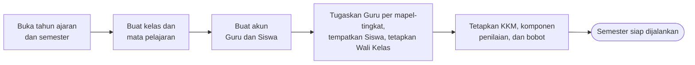
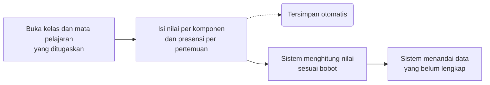
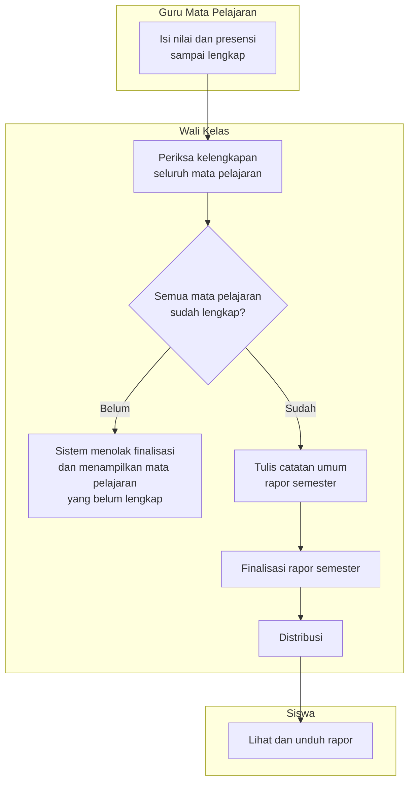
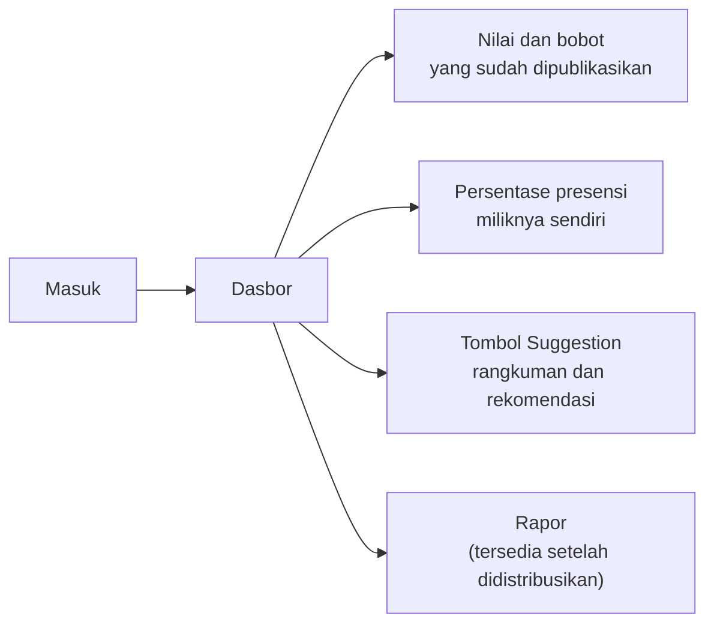
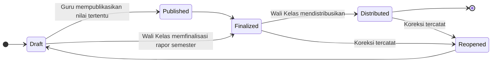

# Product Requirements Document — EduTrack

| Keterangan | Isi |
|---|---|
| **Nama produk** | EduTrack |
| **Project ID** | EDU-2026-001 |
| **Versi** | v2.1 |
| **Tanggal** | 4 Agustus 2026 |
| **Disusun oleh** | Re:Code |
| **Pengguna MVP** | Administrator, Guru (termasuk Guru yang ditugaskan sebagai Wali Kelas), dan Siswa |
| **Kedudukan** | Turunan dari PRD MVP Final, dengan penyesuaian yang tercatat pada §16. Menggantikan seluruh versi PRD.md sebelumnya |

> Dokumen ini menguraikan **apa** yang dibangun beserta alasannya, sepenuhnya dari sisi aplikasi.
> Arsitektur, basis data, antarmuka program, dan pilihan teknologi **tidak dibahas di sini** dan disusun terpisah pada dokumen spesifikasi teknis.
>
> Keputusan pada [§14](#14-hal-yang-harus-divalidasi-dengan-sekolah) wajib dikonfirmasi dengan pihak sekolah sebelum sistem menggunakan data sekolah yang sebenarnya.

---

## Inti Produk

EduTrack membantu sekolah mencatat nilai dan presensi secara teratur, memperlihatkan perkembangan siswa sebelum rapor terbit, kemudian menyatukan seluruh nilai menjadi rapor semester yang dapat dibagikan kepada siswa.

**Lima keputusan produk yang paling menentukan:**

1. Terdapat tiga jenis akun: Administrator, Guru, dan Siswa.
2. Seluruh Guru mengajar mata pelajaran tertentu. Sebagian Guru juga ditetapkan sebagai Wali Kelas.
3. Guru hanya mengelola kelas dan mata pelajaran yang ditugaskan kepadanya.
4. Wali Kelas dapat melihat seluruh nilai mata pelajaran pada kelas walinya, tetapi tidak dapat mengubah nilai milik Guru lain.
5. **Finalisasi rapor semester dilakukan Wali Kelas.** Guru Mata Pelajaran tidak melakukan finalisasi.

---

## 1. Latar Belakang dan Permasalahan

Pada sebagian sekolah, nilai tugas dan ujian baru diketahui secara lengkap ketika rapor telah terbit.

| Pemangku kepentingan | Dampak yang dialami |
|---|---|
| **Siswa dan orang tua** | Tidak mengetahui nilai mana yang rendah, topik mana yang perlu ditingkatkan, bagaimana bobot setiap penilaian, maupun apa yang harus segera diperbaiki selagi waktu masih tersedia |
| **Guru Mata Pelajaran** | Membutuhkan cara yang lebih cepat untuk memeriksa kelengkapan nilai dan presensi seluruh siswa |
| **Wali Kelas** | Perlu menghimpun dan memeriksa kesiapan seluruh mata pelajaran sebelum rapor semester dapat disusun |

### 1.1 Akar permasalahan

Permasalahan utama bukan ketiadaan aplikasi, melainkan **rentang waktu antara pencatatan nilai dan diketahuinya nilai tersebut oleh siswa**. Guru telah memiliki data sejak penilaian pertama, sementara siswa baru mengetahuinya ketika tindakan perbaikan sudah tidak dapat dilakukan.

---

## 2. Solusi yang Ditawarkan

EduTrack menyediakan satu aplikasi web yang:

- memberi siswa akses terhadap nilai, bobot penilaian, presensi, dan rekomendasi belajar miliknya sendiri;
- membantu Guru Mata Pelajaran mencatat nilai dan presensi serta memantau perkembangan siswa;
- membantu Wali Kelas memeriksa kesiapan seluruh mata pelajaran, memfinalisasi rapor semester, dan mendistribusikannya.

---

## 3. Tujuan Produk

| # | Tujuan |
|---|---|
| G1 | Membuat nilai, bobot penilaian, dan pencatatan presensi lebih transparan |
| G2 | Mengurangi pekerjaan rekapitulasi manual pada saat penyusunan rapor |
| G3 | Memungkinkan siswa mengetahui kekurangannya pada nilai tertentu dan memperoleh rekomendasi belajar yang mudah dipahami |

---

## 4. Batas MVP

MVP adalah versi awal yang hanya memuat fungsi paling penting agar alur sekolah dapat diuji dari awal sampai akhir.

### 4.1 Masuk MVP

| # | Cakupan |
|---|---|
| M1 | Pembuatan akun Guru dan Siswa serta sesi kelas |
| M2 | Administrator menugaskan Kelas, Siswa, Guru, Mata Pelajaran, Semester, dan Tahun Ajaran. **Penugasan mata pelajaran bersifat per tingkat** — misalnya Matematika X, Biologi XI |
| M3 | Administrator menetapkan **KKM, komponen penilaian, dan bobot**. Komponen dibuat bebas oleh Administrator, misalnya T1, T2, T3, U1, U2, U3, U4, UTS, UAS. **Belum tersedia templat siap pakai** |
| M4 | **Guru Mata Pelajaran** menginput nilai dan presensi siswa |
| M5 | **Wali Kelas** memfinalisasi rapor, mendistribusikan rapor, serta mengunduh nilai dan rapor |
| M6 | AI Insight untuk siswa |
| M7 | Pembobotan penilaian **hanya untuk ranah Pengetahuan** |

### 4.2 Belum Masuk MVP

| # | Di luar cakupan | Keterangan |
|---|---|---|
| NG1 | Portal khusus orang tua | Orang tua mengakses melalui akun siswa |
| NG2 | Integrasi dengan aplikasi sekolah lain | Tidak ada pertukaran data dengan sistem pihak ketiga |
| NG3 | Banyak pilihan templat rapor | Hanya tersedia satu format |
| NG4 | Prediksi kelulusan atau keputusan otomatis | Bertentangan dengan batasan AI pada §8.5 |
| NG5 | Aplikasi mobile Android/iOS | Antarmuka web, tetap wajib terbaca pada perangkat bergerak |
| NG6 | RPS atau modul rencana pembelajaran | — |
| NG7 | AI Learning Coach untuk membuat latihan soal | — |
| NG8 | Kenaikan kelas | Perpindahan tahun ajaran belum ditangani sistem |
| NG9 | Riwayat nilai jenjang sebelumnya | Sistem hanya menyajikan periode berjalan |
| NG10 | Pembobotan dinamis per mata pelajaran | Komponen dan bobot mengikuti ketetapan Administrator |
| NG11 | **Penilaian Keterampilan, Sikap Sosial, dan Sikap Spiritual** | MVP hanya menangani ranah Pengetahuan |
| NG12 | **Umpan balik atau tindak lanjut presensi** | Presensi hanya menampilkan persentase, tanpa peringatan maupun anjuran |
| NG13 | **Templat komponen penilaian siap pakai** | Administrator menyusun komponen secara manual |
| NG14 | **Penyimpanan riwayat rekomendasi AI** | Keluaran bersifat sementara dan tidak tersimpan |

---

## 5. Pengguna dan Peran

| Peran | Jenis | Cakupan kerja | Terhadap nilai akademik |
|---|---|---|---|
| **Administrator** | Jenis akun | Seluruh sekolah | **Akses penuh**, termasuk mengisi dan mengubah nilai |
| **Guru Mata Pelajaran** | Jenis akun | Kelas dan mata pelajaran yang ditugaskan kepadanya | Mengisi dan menyunting, terbatas pada penugasannya |
| **Wali Kelas** | **Kewenangan tambahan** pada akun Guru | Satu kelas asuhan, seluruh mata pelajaran | Hanya membaca; tidak dapat mengubah nilai Guru lain |
| **Siswa** | Jenis akun | Dirinya sendiri | Hanya membaca |

Seluruh Guru merupakan Guru Mata Pelajaran. Wali Kelas bukan jenis akun baru, melainkan kewenangan tambahan yang diberikan Administrator kepada Guru tertentu. Satu orang dapat memegang kedua fungsi tersebut sekaligus.

### 5.1 Administrator

Administrator menyiapkan data dan aturan sekolah, serta memiliki akses penuh terhadap seluruh data termasuk nilai akademik.

1. Membuat tahun ajaran, semester, kelas, dan mata pelajaran
2. Membuat dan mengelola akun Guru serta Siswa
3. Menempatkan siswa ke kelas
4. Menugaskan Guru ke mata pelajaran pada tingkat tertentu, misalnya Matematika X
5. Menetapkan Guru tertentu sebagai Wali Kelas
6. Menetapkan KKM, komponen penilaian, dan bobot
7. Mengisi dan mengubah nilai akademik apabila diperlukan

### 5.2 Guru Mata Pelajaran

Guru hanya dapat bekerja pada kelas dan mata pelajaran yang diberikan oleh Administrator.

1. Mengisi dan menyunting nilai
2. Mengisi dan menyunting presensi setiap pertemuan
3. Mempublikasikan nilai tertentu agar dapat dilihat siswa
4. Melihat progres siswa pada penugasannya
5. **Tidak melakukan finalisasi rapor**

### 5.3 Wali Kelas

Wali Kelas merupakan kewenangan tambahan pada akun Guru.

1. Melihat nilai seluruh mata pelajaran milik siswa di kelas walinya
2. Memeriksa apakah seluruh Guru telah menginput semua nilai
3. Menulis atau menyunting catatan umum rapor semester
4. Memfinalisasi rapor semester setelah seluruh mata pelajaran lengkap
5. Mendistribusikan rapor kepada siswa
6. Mengunduh nilai dan rapor
7. **Tidak dapat mengubah nilai yang dibuat oleh Guru Mata Pelajaran lain**

### 5.4 Siswa

1. Melihat nilai dan bobot penilaian yang sudah dipublikasikan Guru
2. Melihat persentase presensi miliknya sendiri
3. Memperoleh rangkuman dan rekomendasi belajar melalui tombol Suggestion
4. Melihat dan mengunduh rapor setelah Wali Kelas mendistribusikannya

---

## 6. Alur Kerja Utama

> Setiap alur disajikan dalam dua bentuk yang menggambarkan hal yang sama:
> **gambar** untuk pembacaan manusia, dan **blok Mermaid** untuk pemrosesan otomatis
> serta perenderan pada GitHub, VS Code, dan Notion.

### 6.1 Persiapan semester — Administrator



### 6.2 Pencatatan nilai dan presensi — Guru Mata Pelajaran




### 6.3 Finalisasi dan distribusi rapor — Wali Kelas

Finalisasi dilakukan **satu kali**, oleh Wali Kelas, setelah seluruh mata pelajaran pada kelas asuhannya lengkap.



> **Catatan:** diagram gambar untuk §6.1 dan §6.3 belum tersedia karena layanan pembuatan gambar sedang tidak dapat diakses. Blok Mermaid di atas bersifat lengkap dan dapat langsung dipakai.

### 6.4 Akses nilai — Siswa




---

## 7. Fitur Wajib MVP

| Bagian | Fitur yang wajib tersedia |
|---|---|
| **Administrasi** | Tahun ajaran, semester, kelas, mata pelajaran, akun, penempatan siswa, penugasan Guru per mata pelajaran dan tingkat, penetapan Wali Kelas, KKM, komponen penilaian, dan bobot |
| **Nilai** | Input dan edit manual, komponen dan bobot, perhitungan nilai, publikasi nilai, serta penanda data belum lengkap |
| **Presensi** | Pencatatan status hadir/izin/sakit/alpa per pertemuan, penyuntingan, dan **persentase kehadiran** |
| **Rapor Semester** | Nilai dari seluruh mata pelajaran, catatan Wali Kelas, finalisasi, pembuatan berkas rapor, distribusi, dan unduh |
| **AI Insight** | Tombol Suggestion berisi rangkuman capaian dan rekomendasi belajar untuk siswa |

---

## 8. Kemampuan Sistem

### 8.1 Matriks kewenangan

| Kemampuan | Administrator | Guru Mapel | Wali Kelas | Siswa |
|---|:--:|:--:|:--:|:--:|
| Membuat tahun ajaran, semester, kelas, mata pelajaran | ✅ | – | – | – |
| Membuat dan mengelola akun Guru dan Siswa | ✅ | – | – | – |
| Menempatkan siswa ke kelas | ✅ | – | – | – |
| Menugaskan Guru per mata pelajaran dan tingkat | ✅ | – | – | – |
| Menetapkan Wali Kelas | ✅ | – | – | – |
| Menetapkan KKM, komponen penilaian, dan bobot | ✅ | – | – | – |
| **Mengisi dan mengubah nilai akademik** | ✅ **penuh** | ✅ penugasannya | ❌ | ❌ |
| Mengisi dan menyunting presensi | ✅ | ✅ penugasannya | ❌ | ❌ |
| Mempublikasikan nilai kepada siswa | ✅ | ✅ penugasannya | ❌ | – |
| Melihat nilai lintas mata pelajaran | ✅ | ❌ | ✅ kelas walinya | ✅ dirinya |
| Menulis catatan umum rapor semester | ✅ | ❌ | ✅ | – |
| **Memfinalisasi rapor semester** | ✅ | ❌ | ✅ | – |
| Mendistribusikan rapor | ✅ | ❌ | ✅ | – |
| Mengunduh nilai dan rapor | ✅ | ✅ penugasannya | ✅ kelas walinya | ✅ setelah distribusi |
| Menggunakan tombol Suggestion | ❌ | ❌ | ❌ | ✅ dirinya |
| Melihat riwayat aktivitas | ✅ | – | – | – |

### 8.2 Komponen penilaian, bobot, dan KKM

Administrator menetapkan **daftar komponen penilaian** beserta bobotnya. Komponen disusun bebas sesuai kebutuhan sekolah, misalnya:

```
T1  T2  T3        tugas
U1  U2  U3  U4    ulangan harian
UTS               ujian tengah semester
UAS               ujian akhir semester
```

Belum tersedia templat siap pakai; Administrator menyusun daftar komponen secara manual.

```
Nilai akhir mata pelajaran = Σ (nilai komponen × bobot komponen) ÷ 100
```

| Ketentuan | |
|---|---|
| Ranah penilaian | **Hanya Pengetahuan.** Keterampilan, Sikap Sosial, dan Sikap Spiritual di luar cakupan MVP |
| Bobot | Ditetapkan Administrator. **Jumlah seluruh bobot harus tepat 100%** |
| KKM | Batas acuan ketuntasan. **Nilai awal 75**, mengikuti ketentuan yang lazim digunakan sekolah di Indonesia, dan **dapat diubah Administrator** |
| Nilai kosong | **Tidak boleh dianggap sebagai nilai nol.** Sistem menandainya sebagai belum lengkap |
| Nilai final | Tidak ditampilkan sebagai hasil final selama data belum lengkap |

### 8.3 Presensi

Presensi dicatat Guru Mata Pelajaran pada setiap pertemuan kelas dan mata pelajaran.

| Pelaku | Yang dapat dilakukan | Batas kewenangan |
|---|---|---|
| **Administrator** | Melihat dan menyunting seluruh presensi | — |
| **Guru Mapel** | Memilih tanggal, menetapkan status Hadir/Izin/Sakit/Alpa, menambah catatan, dan menyunting | Hanya untuk kelas dan mata pelajaran yang diajarnya |
| **Wali Kelas** | Melihat ringkasan presensi seluruh siswa pada kelas walinya | Tidak mengubah presensi yang dicatat Guru lain |
| **Siswa** | Melihat persentase presensi miliknya sendiri | Tidak dapat membuka presensi siswa lain |

**Ketentuan presensi:**

1. Setiap siswa hanya boleh memiliki satu status pada satu pertemuan
2. Presensi yang belum diisi berarti **Belum Dicatat**, bukan Alpa
3. Koreksi presensi wajib tercatat: nilai lama, nilai baru, pengguna, waktu, dan alasan
4. **Sistem hanya menampilkan persentase kehadiran.** Tidak terdapat peringatan, anjuran, maupun tindak lanjut apa pun berdasarkan angka tersebut

### 8.4 AI Insight — tombol Suggestion

AI digunakan sebagai alat bantu peringkasan dan rekomendasi belajar, **hanya untuk Siswa**.

**Cara kerja**

Fitur dijalankan melalui tombol **Suggestion** pada halaman siswa. Ketika tombol ditekan:

1. Sistem menghimpun seluruh data akademik siswa tersebut pada semester berjalan — nilai setiap mata pelajaran beserta topiknya, KKM, dan kelengkapan penilaian
2. AI berperan sebagai **konsultan pendidikan** dan menyusun rangkuman capaian beserta rekomendasi hal yang perlu ditingkatkan
3. Hasil ditampilkan dalam format percakapan yang terstruktur
4. AI **tidak mengubah data sumber apa pun**

| Pelaku | Data yang dibaca | Yang ditampilkan |
|---|---|---|
| **Siswa** | Seluruh nilai mata pelajaran beserta topiknya pada semester berjalan, KKM, dan kelengkapan penilaian — **hanya milik siswa yang bersangkutan** | Rangkuman capaian dan rekomendasi hal yang perlu ditingkatkan |

**Ketentuan keluaran**

| Aspek | Ketentuan |
|---|---|
| Pemicu | Tombol **Suggestion**. Tidak berjalan otomatis |
| Interaksi | **Sekali jalan.** Tidak ada pertanyaan lanjutan dan tidak ada kolom masukan dari siswa |
| Format | Percakapan yang terstruktur |
| Susunan jawaban | **Tidak distandarkan.** AI bebas menyusun isi sepanjang relevan dengan data yang diberikan |
| Bahasa | **Profesional**, sebagaimana seorang konsultan pendidikan |
| Penyimpanan | **Tidak disimpan.** Hasil hilang ketika halaman dimuat ulang; menekan tombol kembali menghasilkan keluaran baru |

Karena susunan jawaban tidak distandarkan, **fakta sumber, periode data, dan penanda Data Sementara ditampilkan oleh halaman** di sekitar keluaran AI, bukan dituntut menjadi bagian dari teks AI.

Karena keluaran tidak disimpan, tidak tersedia riwayat rekomendasi yang pernah ditampilkan kepada siswa. Konsekuensi ini diterima secara sadar untuk MVP.

### 8.5 Larangan bagi AI

1. Tidak menghitung atau menentukan nilai resmi
2. Tidak mengubah KKM, bobot, nilai, atau presensi
3. Tidak memfinalisasi atau mendistribusikan rapor
4. Tidak membuat prediksi kelulusan, diagnosis psikologis, atau keputusan sanksi
5. Tidak menampilkan rata-rata final apabila data belum lengkap
6. Tidak membaca data siswa selain siswa yang menekan tombol
7. Kegagalan layanan AI tidak menghambat input nilai, presensi, finalisasi, maupun distribusi rapor

---

## 9. Status Nilai dan Rapor

Penyimpanan bersifat otomatis selama data berstatus Draft.

| Status | Arti | Dapat dilihat Siswa? |
|---|---|---|
| **Draft** | Masih dikerjakan dan dapat diperbaiki oleh Guru | Tidak, kecuali nilai tertentu sengaja dipublikasikan |
| **Published** | Nilai perkembangan diizinkan untuk dilihat siswa | Ya, untuk nilai tersebut |
| **Finalized** | Seluruh mata pelajaran telah diperiksa dan rapor semester dikunci oleh Wali Kelas | Belum, sampai didistribusikan |
| **Distributed** | Rapor resmi telah dibagikan oleh Wali Kelas | Ya |
| **Reopened** | Data final dibuka kembali untuk koreksi yang tercatat | Sesuai kebijakan sekolah |



### Mengapa finalisasi penting

Finalisasi mencegah nilai berubah tanpa sepengetahuan pihak terkait setelah rapor disusun. Apabila koreksi diperlukan, sistem menyimpan alasan, pengguna yang melakukan perubahan, waktu, dan versi rapor baru.

---

## 10. Aturan Produk

| # | Aturan |
|---|---|
| P1 | Seluruh Guru merupakan Guru Mata Pelajaran. Kewenangan Wali Kelas hanya tambahan pada Guru tertentu |
| P2 | Penugasan Guru terkait dengan satu mata pelajaran pada satu tingkat, untuk kelas dan semester tertentu |
| P3 | Satu kelas hanya memiliki satu Wali Kelas aktif dalam satu semester |
| P4 | Administrator menetapkan KKM, komponen penilaian, dan bobot; jumlah seluruh bobot harus tepat 100% |
| P5 | Nilai kosong tidak boleh dianggap sebagai nilai nol; sistem menandainya sebagai belum lengkap |
| P6 | Satu siswa hanya memiliki satu status presensi per pertemuan; data kosong berarti Belum Dicatat, bukan Alpa |
| P7 | Koreksi presensi harus tercatat dan hanya dapat dilakukan pada lingkup penugasan Guru |
| P8 | Guru Mata Pelajaran hanya dapat melihat dan mengubah nilai pada penugasannya sendiri |
| P9 | **Finalisasi rapor semester hanya dilakukan Wali Kelas.** Guru Mata Pelajaran tidak melakukan finalisasi |
| P10 | Wali Kelas tidak dapat mengubah nilai Guru lain; Wali Kelas hanya dapat meminta koreksi |
| P11 | Rapor semester tidak dapat difinalisasi sebelum seluruh mata pelajaran pada kelas tersebut lengkap |
| P12 | Siswa hanya dapat melihat datanya sendiri dan hanya dapat membuka rapor yang sudah didistribusikan |
| P13 | Setelah finalisasi, koreksi harus melalui proses buka kembali dengan alasan dan riwayat perubahan |
| P14 | **Administrator memiliki akses penuh terhadap seluruh data, termasuk nilai akademik.** Setiap perubahan oleh Administrator tetap tercatat pada riwayat aktivitas |
| P15 | AI hanya membaca data milik siswa yang bersangkutan dan tidak menulis ke data akademik |
| P16 | Presensi hanya disajikan sebagai persentase, tanpa peringatan maupun anjuran |

---

## 11. Use Case Utama

| ID | Pelaku | Kegiatan | Berhasil apabila |
|---|---|---|---|
| UC-01 | Semua pengguna | Masuk dan keluar aplikasi | Pengguna hanya melihat menu sesuai kewenangannya |
| UC-02 | Administrator | Menyiapkan periode, kelas, dan mata pelajaran | Data periode tersimpan dan dapat dipakai untuk penugasan |
| UC-03 | Administrator | Membuat akun Guru dan Siswa | Akun unik, aktif, dan dapat digunakan |
| UC-04 | Administrator | Menugaskan Guru per mata pelajaran dan tingkat, menempatkan Siswa, menetapkan Wali Kelas | Setiap pengguna masuk ke kelas serta tugas yang benar |
| UC-05 | Administrator | Menetapkan KKM, komponen penilaian, dan bobot | KKM valid dan jumlah bobot sama dengan 100% |
| UC-06 | Administrator | Mengoreksi nilai akademik | Perubahan tersimpan dan tercatat pada riwayat aktivitas |
| UC-07 | Guru Mapel | Mengisi nilai | Nilai tersimpan pada kelas dan mata pelajaran tugas Guru |
| UC-08 | Guru Mapel | Mengisi presensi | Satu status tercatat untuk setiap siswa dan pertemuan |
| UC-09 | Guru Mapel | Mempublikasikan nilai tertentu | Nilai tersebut dapat dilihat siswa yang bersangkutan |
| UC-10 | Wali Kelas | Melihat seluruh nilai mata pelajaran kelas walinya | Semua mata pelajaran terlihat tanpa izin mengubah nilai Guru lain |
| UC-11 | Wali Kelas | Memeriksa kelengkapan seluruh mata pelajaran | Mata pelajaran yang belum lengkap ditampilkan secara jelas |
| UC-12 | Wali Kelas | Memfinalisasi rapor semester | Berhasil hanya apabila seluruh mata pelajaran sudah lengkap |
| UC-13 | Wali Kelas | Mendistribusikan rapor | Status dan waktu distribusi tercatat |
| UC-14 | Siswa | Melihat nilai dan presensi sendiri | Data siswa lain tidak dapat dibuka |
| UC-15 | Siswa | Menekan tombol Suggestion | Keluaran disusun dari seluruh data semester berjalan miliknya, memakai bahasa profesional, dan tidak tersimpan setelah halaman dimuat ulang |
| UC-16 | Siswa | Melihat dan mengunduh rapor | Rapor hanya tersedia setelah didistribusikan |

> **Prinsip use case:** setiap kegiatan harus memiliki pelaku yang jelas, batas akses yang jelas, hasil yang dapat diperiksa, dan pesan kesalahan yang dapat dipahami apabila proses tidak dapat dilanjutkan.

---

## 12. Layar Minimum

| Pengguna | Layar yang wajib tersedia |
|---|---|
| **Semua** | Masuk, ganti dan atur ulang kata sandi, profil, serta halaman akses ditolak |
| **Administrator** | Dasbor, periode, kelas, mata pelajaran, akun, penugasan, KKM, komponen penilaian, bobot, pengelolaan nilai, dan riwayat aktivitas |
| **Guru Mapel** | Dasbor tugas, daftar siswa, nilai, presensi per pertemuan, ringkasan presensi, dan publikasi nilai |
| **Wali Kelas** | Dasbor kelas wali, ringkasan presensi kelas, kesiapan setiap mata pelajaran, catatan rapor, finalisasi, distribusi, dan unduh |
| **Siswa** | Dasbor, nilai dan bobot, persentase presensi sendiri, tombol Suggestion, serta rapor |

---

## 13. Kriteria Aplikasi Dianggap Siap

| ID | Kriteria |
|---|---|
| AC-01 | Administrator dapat menyiapkan satu semester lengkap tanpa data ganda maupun penugasan yang keliru |
| AC-02 | Penugasan Guru tercatat per mata pelajaran dan tingkat, dan Guru hanya melihat penugasannya sendiri |
| AC-03 | Guru tidak dapat membuka kelas atau mata pelajaran yang bukan tugasnya |
| AC-04 | Administrator dapat menyusun komponen penilaian secara bebas, dan jumlah bobot yang tidak sama dengan 100% ditolak disertai pesan yang menyebutkan total saat ini |
| AC-05 | Perhitungan nilai sesuai KKM, komponen, dan bobot yang ditetapkan Administrator |
| AC-06 | Nilai kosong ditampilkan sebagai belum lengkap, bukan sebagai nol |
| AC-07 | Sistem menolak finalisasi rapor semester apabila masih terdapat mata pelajaran yang belum lengkap |
| AC-08 | Guru Mata Pelajaran tidak memiliki jalur apa pun untuk memfinalisasi rapor |
| AC-09 | Wali Kelas dapat melihat seluruh mata pelajaran kelasnya tetapi tidak dapat mengubah nilai Guru lain |
| AC-10 | Siswa tidak dapat membuka data atau rapor siswa lain |
| AC-11 | Presensi yang belum diisi tidak berubah menjadi Alpa, dan satu pertemuan tidak memiliki status ganda untuk siswa yang sama |
| AC-12 | Presensi hanya menampilkan persentase, tanpa peringatan maupun anjuran |
| AC-13 | Rapor yang diterima siswa sama dengan data yang sudah difinalisasi |
| AC-14 | Koreksi setelah finalisasi tercatat lengkap: alasan, pengguna, waktu, dan versi rapor baru |
| AC-15 | Perubahan nilai oleh Administrator tercatat pada riwayat aktivitas |
| AC-16 | Rekomendasi hanya muncul setelah tombol Suggestion ditekan, dan hilang ketika halaman dimuat ulang |
| AC-17 | Data yang dibaca AI hanya milik siswa yang bersangkutan pada semester berjalan |
| AC-18 | Keluaran AI menggunakan bahasa profesional dan tidak memuat prakiraan kelulusan maupun perbandingan antarsiswa |
| AC-19 | Fakta sumber, periode data, dan penanda Data Sementara tetap terlihat pada halaman meskipun susunan jawaban AI berbeda-beda |
| AC-20 | AI tidak pernah mengubah nilai, presensi, status final, maupun distribusi |
| AC-21 | Kegagalan layanan AI tidak menghambat input nilai, presensi, finalisasi, maupun distribusi |
| AC-22 | KKM bernilai awal 75 dan dapat diubah Administrator |
| AC-23 | Minimal 90% skenario uji pengguna berhasil dan tidak terdapat kesalahan kritis yang masih terbuka |

---

## 14. Hal yang Harus Divalidasi dengan Sekolah

| # | Yang harus divalidasi |
|---|---|
| V1 | Komponen penilaian dan bobot yang benar-benar digunakan |
| V2 | Nilai KKM, serta apakah berlaku menyeluruh atau berbeda per mata pelajaran, tingkat, dan semester |
| V3 | Aturan remedial dan cara mengganti nilai setelah remedial |
| V4 | Pihak yang berwenang membuka kembali rapor yang sudah final |
| V5 | Format rapor resmi sekolah dan data wajib yang harus tercantum |
| V6 | Kebijakan privasi, lama penyimpanan data, pencadangan, dan penggunaan data nyata untuk AI |

---

## 15. Pertanyaan Terbuka

| # | Pertanyaan | Menahan |
|---|---|---|
| Q1 | **Berapa lama rentang pengembangan yang berlaku?** Baseline memuat rencana 12 minggu, sedangkan Project Charter menetapkan penyelesaian 14 Agustus 2026 | Perencanaan seluruh tim |
| Q2 | **Identitas masuk siswa: surel atau NIS?** Baseline hanya menyatakan akun harus unik dan aktif, sedangkan sekolah menengah pada umumnya tidak menyediakan surel bagi siswa | Pembuatan akun |
| Q3 | **Apakah KKM, komponen, dan bobot berlaku sama untuk seluruh mata pelajaran**, atau dapat berbeda per mata pelajaran dan tingkat? Penugasan Guru sudah bersifat per tingkat, sehingga kemungkinan ketetapan penilaian juga demikian | Layar penetapan KKM dan bobot |
| Q4 | **Siapa yang berwenang mempublikasikan nilai (status Published), dan apakah dapat dibatalkan?** | Alur nilai |
| Q5 | **Apakah unggah berkas Excel termasuk MVP?** Terdapat pada prototipe antarmuka, tetapi baseline hanya menyebut input dan edit manual | Persiapan semester |
| Q6 | **Apakah pemberitahuan dalam aplikasi termasuk MVP?** Baseline menyebut "notifikasi data belum lengkap" tanpa menjelaskan bentuk maupun cakupannya | Alur nilai dan rapor |
| Q7 | **"Dua pilihan tindakan yang realistis"** — baseline mensyaratkannya, sedangkan susunan jawaban AI ditetapkan tidak distandarkan. Dokumen ini memperlakukannya sebagai anjuran pada instruksi ke AI, bukan syarat yang divalidasi sistem | Ketentuan keluaran AI |

---

## 16. Penyesuaian terhadap Baseline

Dokumen ini menyimpang dari PRD MVP Final pada beberapa titik berikut. **Perbedaan ini perlu dikembalikan ke penyusun baseline agar dokumen aslinya diperbarui.**

| # | Ketentuan baseline | Ketentuan dokumen ini | Dampak |
|---|---|---|---|
| D1 | **Dua tingkat finalisasi**: Guru Mapel memfinalisasi rapor mata pelajaran, Wali Kelas memfinalisasi rapor semester | **Satu tingkat finalisasi**, hanya oleh Wali Kelas | Status *Finalized Mapel* dihapus. Rapor Mapel tidak lagi menjadi dokumen tersendiri. Aturan P9 dan use case terkait disesuaikan |
| D2 | **Administrator tidak mengisi maupun mengubah nilai akademik**, dan tidak memiliki menu untuk itu | **Administrator memiliki akses penuh**, termasuk mengubah nilai | Menghapus satu pengaman integritas yang dirancang baseline. Diimbangi dengan pencatatan wajib pada riwayat aktivitas (AC-15) |
| D3 | Presensi menandai "siswa yang melewati batas perhatian sekolah" | Presensi hanya menampilkan persentase | Tidak ada peringatan maupun anjuran |
| D4 | AI Insight tersedia bagi Guru dan Wali Kelas pada use case §9 dan daftar layar §12 | **Hanya untuk Siswa**, sesuai §4, §7, dan §8 baseline | Bagian baseline yang bertentangan perlu dihapus |
| D5 | Presensi kosong ditampilkan sebagai Alpa (§7.1) | Presensi kosong berarti **Belum Dicatat** | Mengikuti aturan produk dan kriteria kesiapan baseline, yang menyatakan sebaliknya dari §7.1 |
| D6 | Administrator menetapkan "KKM dan bobot penilaian standar" | Administrator menetapkan **KKM, komponen penilaian, dan bobot** | Komponen penilaian sebelumnya tidak disebut sebagai hal yang ditetapkan Administrator |

**Perlu diperhatikan pada D2:** baseline menyatakan bahwa finalisasi bertujuan *"mencegah nilai berubah diam-diam setelah rapor disusun"*. Dengan Administrator memperoleh akses penuh terhadap nilai, jaminan tersebut tidak lagi bersifat struktural, melainkan bergantung pada pencatatan riwayat dan kedisiplinan pengguna. Keputusan ini perlu disampaikan kepada pihak sekolah pada saat validasi §14.

---

## Lampiran A — Glosarium

| Istilah | Definisi |
|---|---|
| **Administrator** | Akun yang menyiapkan periode, kelas, mata pelajaran, akun, penugasan, KKM, komponen penilaian, dan bobot, serta memiliki akses penuh terhadap seluruh data termasuk nilai akademik |
| **Guru Mapel** | Guru yang ditugaskan mengajar satu mata pelajaran pada tingkat tertentu serta mengelola nilai dan presensi pada penugasannya |
| **Wali Kelas** | Kewenangan tambahan pada akun Guru untuk memantau kelas wali, memeriksa kelengkapan, memfinalisasi rapor semester, dan mendistribusikannya |
| **Siswa** | Pengguna yang hanya dapat melihat nilai, bobot, presensi, rekomendasi, dan rapor miliknya sendiri sesuai status publikasi |
| **KKM** | Kriteria Ketuntasan Minimal yang ditetapkan sekolah sebagai batas acuan ketuntasan hasil belajar. Nilai awal 75 |
| **Komponen Penilaian** | Satuan penilaian yang menyusun nilai akhir, misalnya T1, U1, UTS, UAS. Ditetapkan Administrator |
| **Bobot Penilaian** | Persentase kontribusi setiap komponen terhadap nilai akhir. Jumlah seluruh bobot harus tepat 100% |
| **Nilai Tracker** | Fungsi untuk mencatat, menghitung, menampilkan kelengkapan, dan memantau perkembangan nilai siswa |
| **Rapor Semester** | Dokumen hasil belajar semester yang menggabungkan nilai seluruh mata pelajaran dan difinalisasi oleh Wali Kelas |
| **AI Insight** | Rangkuman dan rekomendasi belajar yang dihasilkan melalui tombol Suggestion, berbasis data akademik siswa yang bersangkutan. Tidak tersimpan dan tidak mengubah data |
| **Finalisasi** | Proses mengunci rapor semester setelah kelengkapan diperiksa. Koreksi setelah finalisasi harus melalui proses buka kembali dan tercatat |
| **Distribusi** | Tindakan Wali Kelas membagikan rapor semester yang telah final agar dapat dilihat dan diunduh siswa |
| **MVP** | Versi minimum produk yang memuat fungsi inti untuk menguji alur sekolah dari persiapan data sampai rapor diterima siswa |
| **UAT** | User Acceptance Testing, yaitu pengujian penerimaan oleh calon pengguna untuk memastikan aplikasi memenuhi kebutuhan dan alur kerja yang disepakati |
