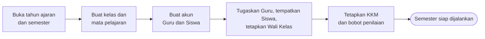
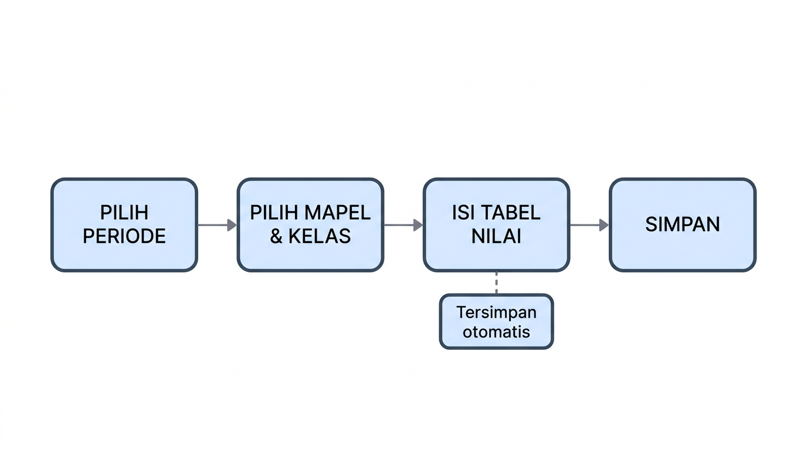
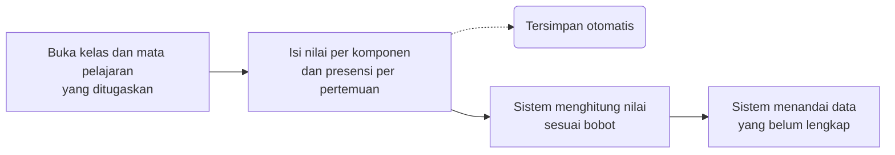
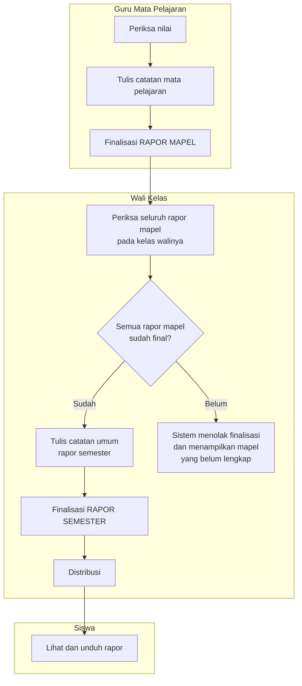
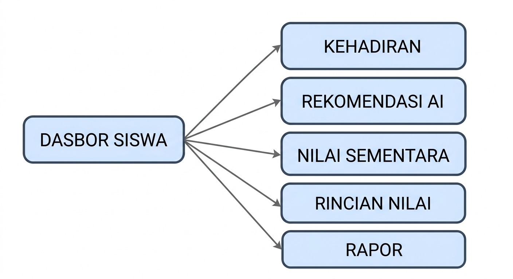
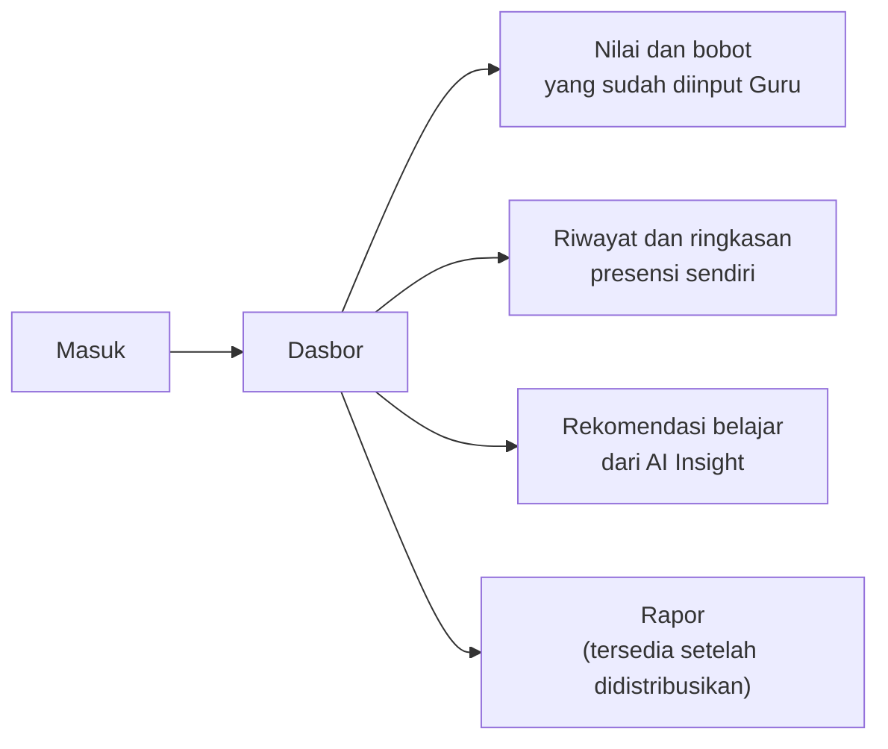
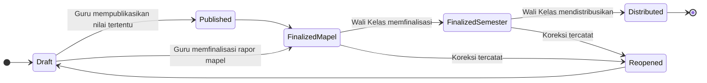

# Product Requirements Document — EduTrack

| Keterangan | Isi |
|---|---|
| **Nama produk** | EduTrack |
| **Project ID** | EDU-2026-001 |
| **Versi** | v2.0 — diselaraskan dengan baseline MVP resmi |
| **Tanggal** | 4 Agustus 2026 |
| **Disusun oleh** | Re:Code |
| **Pengguna MVP** | Administrator, Guru (termasuk Guru yang ditugaskan sebagai Wali Kelas), dan Siswa |
| **Kedudukan** | Turunan dari PRD MVP Final. Menggantikan seluruh versi PRD.md sebelumnya |

> Dokumen ini menguraikan **apa** yang dibangun beserta alasannya, sepenuhnya dari sisi aplikasi.
> Arsitektur, basis data, antarmuka program, dan pilihan teknologi **tidak dibahas di sini** dan disusun terpisah pada dokumen spesifikasi teknis.
>
> Keputusan pada [§13](#13-hal-yang-harus-divalidasi-dengan-sekolah) wajib dikonfirmasi dengan pihak sekolah sebelum sistem menggunakan data sekolah yang sebenarnya.

---

## Inti Produk

EduTrack membantu sekolah mencatat nilai dan presensi secara teratur, memperlihatkan perkembangan siswa sebelum rapor terbit, kemudian menyatukan seluruh nilai menjadi rapor semester yang dapat dibagikan kepada siswa.

**Lima keputusan produk yang paling menentukan:**

1. Terdapat tiga jenis akun: Administrator, Guru, dan Siswa.
2. Seluruh Guru mengajar mata pelajaran tertentu. Sebagian Guru juga ditetapkan sebagai Wali Kelas.
3. Guru hanya mengelola kelas dan mata pelajaran yang ditugaskan kepadanya.
4. Wali Kelas dapat melihat seluruh rapor mata pelajaran pada kelas walinya, tetapi tidak dapat mengubah nilai milik Guru lain.
5. Guru memfinalisasi nilai mata pelajaran. Wali Kelas memfinalisasi dan mendistribusikan rapor semester kepada siswa.

---

## 1. Latar Belakang dan Permasalahan

Pada sebagian sekolah, nilai tugas dan ujian baru diketahui secara lengkap ketika rapor telah terbit.

| Pemangku kepentingan | Dampak yang dialami |
|---|---|
| **Siswa dan orang tua** | Tidak mengetahui nilai mana yang rendah, topik mana yang perlu ditingkatkan, bagaimana bobot setiap penilaian, maupun apa yang harus segera diperbaiki selagi waktu masih tersedia |
| **Guru Mata Pelajaran** | Membutuhkan cara yang lebih cepat untuk memeriksa kelengkapan nilai dan presensi seluruh siswa |
| **Wali Kelas** | Perlu menghimpun dan memeriksa kesiapan seluruh mata pelajaran sebelum rapor semester dapat disusun |

### 1.1 Akar permasalahan

Permasalahan utama bukan ketiadaan aplikasi, melainkan **rentang waktu antara pencatatan nilai dan diketahuinya nilai tersebut oleh siswa**. Guru telah memiliki data sejak penilaian pertama, sementara siswa baru mengetahuinya ketika tindakan perbaikan sudah tidak dapat dilakukan.

---

## 2. Solusi yang Ditawarkan

EduTrack menyediakan satu aplikasi web yang:

- memberi siswa akses terhadap nilai, bobot penilaian, presensi, dan rekomendasi belajar miliknya sendiri;
- membantu Guru mencatat nilai dan presensi, memantau perkembangan siswa, serta menyiapkan rapor mata pelajaran;
- membantu Wali Kelas memeriksa kesiapan seluruh mata pelajaran, memfinalisasi rapor semester, dan mendistribusikannya.

---

## 3. Tujuan Produk

| # | Tujuan |
|---|---|
| G1 | Membuat nilai, bobot penilaian, dan pencatatan presensi lebih transparan |
| G2 | Mengurangi pekerjaan rekapitulasi manual pada saat penyusunan rapor |
| G3 | Memungkinkan siswa mengetahui kekurangannya pada nilai tertentu dan memperoleh rekomendasi belajar yang mudah dipahami |

---

## 4. Batas MVP

MVP adalah versi awal yang hanya memuat fungsi paling penting agar alur sekolah dapat diuji dari awal sampai akhir.

### 4.1 Masuk MVP

| # | Cakupan |
|---|---|
| M1 | Pembuatan akun Guru dan Siswa serta sesi kelas |
| M2 | Administrator menugaskan Kelas, Siswa, Guru, Mata Pelajaran, Semester, dan Tahun Ajaran |
| M3 | Administrator menetapkan KKM dan bobot penilaian standar |
| M4 | Guru menginput nilai dan presensi siswa |
| M5 | Guru memfinalisasi rapor, mendistribusikan rapor, serta mengunduh nilai dan rapor |
| M6 | AI Insight untuk siswa |
| M7 | Pembobotan mengikuti templat penuh yang ditetapkan Administrator |

### 4.2 Belum Masuk MVP

| # | Di luar cakupan | Keterangan |
|---|---|---|
| NG1 | Portal khusus orang tua | Orang tua mengakses melalui akun siswa |
| NG2 | Integrasi dengan aplikasi sekolah lain | Tidak ada pertukaran data dengan sistem pihak ketiga |
| NG3 | Banyak pilihan templat rapor | Hanya tersedia satu format |
| NG4 | Prediksi kelulusan atau keputusan otomatis | Bertentangan dengan batasan AI pada §8.4 |
| NG5 | Aplikasi mobile Android/iOS | Antarmuka web, tetap wajib terbaca pada perangkat bergerak |
| NG6 | RPS atau modul rencana pembelajaran | — |
| NG7 | AI Learning Coach untuk membuat latihan soal | — |
| NG8 | **Kenaikan kelas** | Perpindahan tahun ajaran belum ditangani sistem |
| NG9 | **Riwayat nilai jenjang sebelumnya** | Sistem hanya menyajikan periode berjalan |
| NG10 | **Pembobotan dinamis sesuai mata pelajaran** | Bobot mengikuti standar tunggal yang ditetapkan Administrator |

---

## 5. Pengguna dan Peran

### 5.1 Administrator

Administrator menyiapkan data dan aturan sekolah. **Administrator tidak mengisi maupun mengubah nilai akademik siswa.**

1. Membuat tahun ajaran, semester, kelas, dan mata pelajaran
2. Membuat dan mengelola akun Guru serta Siswa
3. Menempatkan siswa ke kelas
4. Menugaskan Guru ke kelas dan mata pelajaran
5. Menetapkan Guru tertentu sebagai Wali Kelas
6. Menginput standar KKM dan bobot penilaian

### 5.2 Guru Mata Pelajaran

Seluruh Guru adalah Guru Mata Pelajaran. Guru hanya dapat bekerja pada kelas dan mata pelajaran yang diberikan oleh Administrator.

1. Mengisi dan menyunting nilai sebelum finalisasi
2. Mengisi dan menyunting presensi setiap pertemuan
3. Melihat progres siswa
4. Memfinalisasi rapor mata pelajaran

### 5.3 Wali Kelas

Wali Kelas merupakan **kewenangan tambahan pada akun Guru**, bukan jenis akun baru.

1. Melihat nilai seluruh mata pelajaran milik siswa di kelas walinya
2. Memeriksa apakah seluruh Guru telah menginput semua nilai
3. Menulis atau menyunting catatan umum rapor semester
4. Memfinalisasi rapor semester setelah seluruh mata pelajaran lengkap
5. Mendistribusikan rapor kepada siswa
6. **Tidak dapat mengubah nilai yang dibuat oleh Guru Mata Pelajaran lain**

### 5.4 Siswa

1. Melihat nilai dan bobot penilaian yang sudah diinput Guru
2. Melihat presensi miliknya sendiri
3. Melihat rekomendasi belajar dari AI Insight berdasarkan data yang tersedia
4. Melihat dan mengunduh rapor setelah Wali Kelas mendistribusikannya

---

## 6. Alur Kerja Utama

> Setiap alur disajikan dalam dua bentuk yang menggambarkan hal yang sama:
> **gambar** untuk pembacaan manusia, dan **blok Mermaid** untuk pemrosesan otomatis
> serta perenderan pada GitHub, VS Code, dan Notion.

### 6.1 Persiapan semester — Administrator



### 6.2 Pencatatan nilai dan presensi — Guru Mata Pelajaran





### 6.3 Dua tingkat finalisasi

Finalisasi pertama dilakukan **Guru Mata Pelajaran** untuk setiap mata pelajaran. Finalisasi kedua dilakukan **Wali Kelas** untuk rapor semester setelah seluruh rapor mata pelajaran selesai.



> **Catatan:** diagram gambar untuk §6.1 dan §6.3 belum tersedia karena layanan pembuatan gambar sedang tidak dapat diakses. Blok Mermaid di atas bersifat lengkap dan dapat langsung dipakai.

### 6.4 Akses nilai — Siswa





---

## 7. Fitur Wajib MVP

| Bagian | Fitur yang wajib tersedia |
|---|---|
| **Administrasi** | Tahun ajaran, semester, kelas, mata pelajaran, akun, penempatan siswa, penugasan Guru, penetapan Wali Kelas, KKM, dan bobot penilaian |
| **Nilai** | Input dan edit manual, komponen dan bobot, perhitungan nilai, serta penanda data belum lengkap |
| **Presensi** | Kehadiran siswa, status hadir/izin/sakit/alpa, penyuntingan presensi, dan ringkasan presensi |
| **Rapor Semester** | Nilai dari seluruh mata pelajaran, catatan Wali Kelas, finalisasi, pembuatan berkas rapor, distribusi, dan unduh |
| **AI Insight** | Rekomendasi belajar untuk siswa |

---

## 8. Kemampuan Sistem

### 8.1 Matriks kewenangan

| Kemampuan | Administrator | Guru Mapel | Wali Kelas | Siswa |
|---|:--:|:--:|:--:|:--:|
| Membuat tahun ajaran, semester, kelas, mata pelajaran | ✅ | – | – | – |
| Membuat dan mengelola akun Guru dan Siswa | ✅ | – | – | – |
| Menempatkan siswa ke kelas | ✅ | – | – | – |
| Menugaskan Guru ke kelas dan mata pelajaran | ✅ | – | – | – |
| Menetapkan Wali Kelas | ✅ | – | – | – |
| Menetapkan KKM dan bobot penilaian | ✅ | – | – | – |
| **Mengubah nilai akademik** | ❌ | ✅ penugasannya | ❌ | ❌ |
| Mengisi dan menyunting presensi | ❌ | ✅ penugasannya | ❌ | ❌ |
| Melihat progres siswa | ✅ | ✅ penugasannya | ✅ kelas walinya | ✅ dirinya |
| Melihat nilai lintas mata pelajaran | ✅ | ❌ | ✅ kelas walinya | ✅ dirinya |
| Memfinalisasi rapor mata pelajaran | ❌ | ✅ | ❌ | – |
| Menulis catatan umum rapor semester | ❌ | ❌ | ✅ | – |
| Memfinalisasi rapor semester | ❌ | ❌ | ✅ | – |
| Mendistribusikan rapor | ❌ | ❌ | ✅ | – |
| Melihat dan mengunduh rapor | ✅ | ✅ penugasannya | ✅ kelas walinya | ✅ setelah distribusi |
| Melihat AI Insight | ❌ | ❌ | ❌ | ✅ dirinya |
| Melihat riwayat aktivitas | ✅ | – | – | – |

### 8.2 Perhitungan nilai, KKM, dan bobot

```
Nilai akhir mata pelajaran = Σ (nilai komponen × bobot komponen) ÷ 100
```

| Ketentuan | |
|---|---|
| Bobot | Ditetapkan Administrator sebagai standar sekolah. **Jumlah seluruh bobot harus tepat 100%** |
| KKM | Kriteria Ketuntasan Minimal, ditetapkan Administrator sebagai batas acuan ketuntasan. **Nilai awal 75**, mengikuti ketentuan yang lazim digunakan sekolah di Indonesia, dan **dapat diubah Administrator** sesuai kebijakan sekolah |
| Nilai kosong | **Tidak boleh dianggap sebagai nilai nol.** Sistem menandainya sebagai belum lengkap |
| Nilai final | Tidak ditampilkan sebagai hasil final selama data belum lengkap |

### 8.3 Presensi

Presensi dicatat oleh Guru pada setiap pertemuan kelas dan mata pelajaran. Data ini dipantau Wali Kelas, dilihat siswa untuk dirinya sendiri, dan digunakan sebagai salah satu fakta pada AI Insight.

| Pelaku | Yang dapat dilakukan | Batas kewenangan |
|---|---|---|
| **Guru** | Memilih tanggal, menetapkan status Hadir/Izin/Sakit/Alpa, menambah catatan, dan menyunting | Hanya untuk kelas dan mata pelajaran yang diajarnya |
| **Wali Kelas** | Melihat ringkasan presensi seluruh siswa pada kelas walinya | Tidak mengubah presensi yang dicatat Guru lain |
| **Siswa** | Melihat daftar dan ringkasan presensi miliknya sendiri | Tidak dapat membuka atau mengubah presensi siswa lain |

**Ketentuan presensi:**

1. Setiap siswa hanya boleh memiliki satu status pada satu pertemuan
2. Presensi yang belum diisi berarti **Belum Dicatat**, bukan Alpa
3. Koreksi presensi wajib tercatat: nilai lama, nilai baru, pengguna, waktu, dan alasan
4. Koreksi hanya dapat dilakukan dalam lingkup penugasan Guru

**Hasil presensi yang ditampilkan:** Guru dan Wali Kelas melihat jumlah Hadir, Izin, Sakit, Alpa, persentase kehadiran, pertemuan yang belum dicatat, serta siswa yang melewati batas perhatian sekolah. Siswa hanya melihat ringkasan miliknya sendiri.

### 8.4 AI Insight

AI digunakan sebagai alat bantu peringkasan dan rekomendasi belajar. AI Insight merupakan ringkasan yang disusun dari nilai, KKM, dan tugas yang belum optimal.

**Cara kerja:**

1. Sistem membaca fakta yang boleh diakses pengguna, misalnya nilai di bawah KKM atau tugas yang belum lengkap
2. AI menyusun penjelasan atau rekomendasi **tanpa mengubah fakta sumber**
3. AI membaca topik tugas sebagai dasar rekomendasi

| Pelaku | Data yang dibaca | Yang ditampilkan |
|---|---|---|
| **Siswa** | Nilai yang sudah diinput Guru dan diizinkan untuk dilihat siswa | Rekomendasi belajar, alasan rekomendasi, serta dua pilihan tindakan yang realistis |

> **AI Insight hanya tersedia untuk Siswa.** Guru dan Wali Kelas tidak memperoleh fitur AI pada MVP ini. Lihat Q9 pada §15 mengenai ketidakkonsistenan baseline pada bagian ini.

**Bentuk penyajian**

Rekomendasi belajar disajikan dalam **gaya percakapan**. Siswa dapat mengajukan pertanyaan lanjutan, dan sistem menjawab **hanya berdasarkan data akademik milik siswa yang bersangkutan**: nilai, KKM, kelengkapan tugas, dan presensi.

| Cakupan percakapan | Contoh |
|---|---|
| **Dijawab** | "Nilai mana yang masih di bawah KKM?" · "Bagian apa yang perlu saya perbaiki?" · "Mengapa nilai Matematika saya rendah?" |
| **Ditolak dengan sopan** | Pertanyaan di luar data akademik siswa tersebut · permintaan prakiraan kelulusan · perbandingan dengan siswa lain · penjelasan materi pelajaran umum |

Setiap jawaban tetap menyertakan fakta sumber dan periode data sebagaimana ketentuan pada butir 6.

**Larangan mutlak bagi AI:**

1. Tidak menghitung atau menentukan nilai resmi
2. Tidak mengubah KKM, bobot, nilai, atau presensi
3. Tidak memfinalisasi atau mendistribusikan rapor
4. Tidak membuat prediksi kelulusan, diagnosis psikologis, atau keputusan sanksi
5. Tidak menampilkan rata-rata final apabila data belum lengkap

**Kriteria AI Insight dianggap benar:**

6. Setiap peringatan menampilkan fakta sumber dan periode data yang digunakan
7. Insight hanya memakai data sesuai kelas, mata pelajaran, dan kewenangan pengguna
8. Apabila nilai, bobot, atau presensi belum lengkap, keluaran diberi label **Data Sementara** dan tidak menyebut hasil final
9. Kegagalan layanan AI tidak menghambat input nilai, presensi, finalisasi, maupun distribusi rapor
10. Tidak ada keluaran AI yang langsung tersimpan sebagai catatan rapor tanpa persetujuan Guru atau Wali Kelas

---

## 9. Status Nilai dan Rapor

Penyimpanan bersifat otomatis selama data berstatus Draft.

| Status | Arti | Dapat dilihat Siswa? |
|---|---|---|
| **Draft** | Masih dikerjakan dan dapat diperbaiki oleh Guru | Tidak, kecuali nilai tertentu sengaja dipublikasikan |
| **Published** | Nilai perkembangan diizinkan untuk dilihat siswa | Ya, untuk nilai tersebut |
| **Finalized Mapel** | Rapor satu mata pelajaran selesai dan dikunci | Belum sebagai rapor semester |
| **Finalized Semester** | Seluruh mata pelajaran telah diperiksa dan rapor semester dikunci | Belum, sampai didistribusikan |
| **Distributed** | Rapor resmi telah dibagikan oleh Wali Kelas | Ya |
| **Reopened** | Data final dibuka kembali untuk koreksi yang tercatat | Sesuai kebijakan sekolah |



### Mengapa finalisasi penting

Finalisasi mencegah nilai berubah tanpa sepengetahuan pihak terkait setelah rapor disusun. Apabila koreksi diperlukan, sistem menyimpan alasan, pengguna yang melakukan perubahan, waktu, dan versi rapor baru.

---

## 10. Aturan Produk

| # | Aturan |
|---|---|
| P1 | Seluruh Guru merupakan Guru Mata Pelajaran. Kewenangan Wali Kelas hanya tambahan pada Guru tertentu |
| P2 | Penugasan Guru selalu terkait dengan satu kelas, satu mata pelajaran, dan satu semester |
| P3 | Satu kelas hanya memiliki satu Wali Kelas aktif dalam satu semester |
| P4 | Administrator mengatur KKM dan bobot standar; jumlah seluruh bobot harus tepat 100% |
| P5 | Nilai kosong tidak boleh dianggap sebagai nilai nol; sistem menandainya sebagai belum lengkap |
| P6 | Satu siswa hanya memiliki satu status presensi per pertemuan; data kosong berarti Belum Dicatat, bukan Alpa |
| P7 | Koreksi presensi harus tercatat dan hanya dapat dilakukan pada lingkup penugasan Guru |
| P8 | Guru hanya dapat melihat dan mengubah nilai pada penugasannya sendiri |
| P9 | Rapor mata pelajaran hanya dapat difinalisasi oleh Guru Mata Pelajaran yang bertanggung jawab |
| P10 | Wali Kelas tidak dapat mengubah nilai Guru lain; Wali Kelas hanya dapat meminta koreksi |
| P11 | Rapor semester tidak dapat difinalisasi sebelum seluruh rapor mata pelajaran berstatus final |
| P12 | Siswa hanya dapat melihat datanya sendiri dan hanya dapat membuka rapor yang sudah didistribusikan |
| P13 | Setelah finalisasi, koreksi harus melalui proses buka kembali dengan alasan dan riwayat perubahan |
| P14 | Administrator tidak memiliki menu maupun layanan untuk mengubah nilai akademik |
| P15 | AI Insight selalu menunjukkan fakta sumber, tidak melampaui kewenangan pengguna, dan tidak menulis ke data akademik |

---

## 11. Use Case Utama

| ID | Pelaku | Kegiatan | Berhasil apabila |
|---|---|---|---|
| UC-01 | Semua pengguna | Masuk dan keluar aplikasi | Pengguna hanya melihat menu sesuai kewenangannya |
| UC-02 | Administrator | Menyiapkan periode, kelas, dan mata pelajaran | Data periode tersimpan dan dapat dipakai untuk penugasan |
| UC-03 | Administrator | Membuat akun Guru dan Siswa | Akun unik, aktif, dan dapat digunakan |
| UC-04 | Administrator | Menugaskan Guru, Siswa, dan Wali Kelas | Setiap pengguna masuk ke kelas serta tugas yang benar |
| UC-05 | Administrator | Menetapkan KKM dan bobot | KKM valid dan jumlah bobot sama dengan 100% |
| UC-06 | Guru Mapel | Mengisi nilai | Nilai tersimpan pada kelas dan mata pelajaran tugas Guru |
| UC-07 | Guru Mapel | Mengisi presensi | Satu status tercatat untuk setiap siswa dan pertemuan |
| UC-08 | Guru Mapel | Menulis catatan mata pelajaran | Catatan tersimpan pada rapor mata pelajaran penugasannya |
| UC-09 | Guru Mapel | Memfinalisasi rapor mata pelajaran | Finalisasi berhasil hanya apabila nilai wajib lengkap |
| UC-10 | Wali Kelas | Melihat seluruh rapor mata pelajaran kelas | Semua mata pelajaran terlihat tanpa izin mengubah nilai Guru lain |
| UC-11 | Wali Kelas | Memfinalisasi rapor semester | Berhasil hanya apabila seluruh rapor mata pelajaran sudah final |
| UC-12 | Wali Kelas | Mendistribusikan rapor | Status dan waktu distribusi tercatat |
| UC-13 | Siswa | Melihat nilai dan presensi sendiri | Data siswa lain tidak dapat dibuka |
| UC-14 | Siswa | Melihat rekomendasi belajar | Rekomendasi sesuai data dan diberi label apabila belum lengkap |
| UC-15 | Siswa | Melihat dan mengunduh rapor | Rapor hanya tersedia setelah didistribusikan |

### 11.1 Presensi dan AI Insight

| ID | Pelaku | Kegiatan | Berhasil apabila |
|---|---|---|---|
| UC-ATT-01 | Guru Mapel | Mencatat presensi per pertemuan | Setiap siswa memiliki satu status dan waktu penyimpanan tercatat |
| UC-ATT-02 | Guru Mapel | Mengoreksi presensi | Nilai lama, nilai baru, pengguna, waktu, dan alasan koreksi tersimpan |
| UC-ATT-03 | Wali Kelas / Siswa | Melihat ringkasan presensi | Wali Kelas hanya melihat kelas walinya; siswa hanya melihat data sendiri |
| UC-AI-01 | Siswa | Melihat rekomendasi belajar | Rekomendasi memuat alasan, dua pilihan tindakan, dan label apabila data sementara |

> **Prinsip use case:** setiap kegiatan harus memiliki pelaku yang jelas, batas akses yang jelas, hasil yang dapat diperiksa, dan pesan kesalahan yang dapat dipahami apabila proses tidak dapat dilanjutkan.

---

## 12. Layar Minimum

| Pengguna | Layar yang wajib tersedia |
|---|---|
| **Semua** | Masuk, ganti dan atur ulang kata sandi, profil, serta halaman akses ditolak |
| **Administrator** | Dasbor, periode, kelas, mata pelajaran, akun, penugasan, KKM, bobot, dan riwayat aktivitas |
| **Guru Mapel** | Dasbor tugas, daftar siswa, nilai, presensi per pertemuan, ringkasan presensi, rapor mata pelajaran, dan catatan mata pelajaran |
| **Wali Kelas** | Dasbor kelas wali, ringkasan presensi kelas, kesiapan setiap mata pelajaran, rapor semester, finalisasi, dan distribusi |
| **Siswa** | Dasbor, nilai dan bobot, riwayat presensi sendiri, rekomendasi belajar, serta rapor |

---

## 13. Kriteria Aplikasi Dianggap Siap

| ID | Kriteria |
|---|---|
| AC-01 | Administrator dapat menyiapkan satu semester lengkap tanpa data ganda maupun penugasan yang keliru |
| AC-02 | Guru tidak dapat membuka kelas atau mata pelajaran yang bukan tugasnya |
| AC-03 | Perhitungan nilai sesuai KKM dan bobot yang ditetapkan sekolah |
| AC-04 | Sistem menolak finalisasi apabila nilai wajib atau rapor mata pelajaran belum lengkap |
| AC-05 | Wali Kelas dapat melihat seluruh mata pelajaran kelasnya tetapi tidak dapat mengubah nilai Guru lain |
| AC-06 | Siswa tidak dapat membuka data atau rapor siswa lain |
| AC-07 | Presensi yang belum diisi tidak berubah menjadi Alpa, dan satu pertemuan tidak memiliki status ganda untuk siswa yang sama |
| AC-08 | Setiap AI Insight dapat ditelusuri ke nilai, KKM, tugas, atau presensi yang menjadi sumbernya |
| AC-09 | Rapor yang diterima siswa sama dengan data yang sudah difinalisasi |
| AC-10 | AI tidak pernah mengubah nilai, presensi, status final, maupun distribusi |
| AC-11 | Administrator tidak memiliki jalur apa pun untuk mengubah nilai akademik |
| AC-12 | Jumlah bobot yang tidak sama dengan 100% ditolak disertai pesan yang menyebutkan total saat ini |
| AC-13 | Nilai kosong ditampilkan sebagai belum lengkap, bukan sebagai nol |
| AC-14 | Koreksi setelah finalisasi tercatat lengkap: alasan, pengguna, waktu, dan versi rapor baru |
| AC-15 | Kegagalan layanan AI tidak menghambat input nilai, presensi, finalisasi, maupun distribusi |
| AC-16 | Minimal 90% skenario uji pengguna berhasil dan tidak terdapat kesalahan kritis yang masih terbuka |
| AC-17 | AI menolak dengan sopan pertanyaan di luar data akademik siswa yang bersangkutan, termasuk permintaan prakiraan kelulusan dan perbandingan dengan siswa lain |
| AC-18 | AI tidak dapat mengakses data siswa lain, walaupun diminta secara langsung dalam percakapan |
| AC-19 | KKM bernilai awal 75 dan dapat diubah Administrator; perubahan berlaku pada perhitungan ketuntasan berikutnya |

---

## 14. Hal yang Harus Divalidasi dengan Sekolah

Konsep produk sudah cukup matang sebagai baseline MVP, tetapi keputusan berikut wajib dikonfirmasi sebelum sistem memakai data sekolah yang sebenarnya.

| # | Yang harus divalidasi |
|---|---|
| V1 | Rumus nilai, jenis komponen penilaian, dan bobot yang benar-benar digunakan |
| V2 | Nilai KKM per mata pelajaran, tingkat kelas, atau semester |
| V3 | Aturan remedial dan cara mengganti nilai setelah remedial |
| V4 | Pihak yang berwenang membuka kembali nilai atau rapor yang sudah final |
| V5 | Format rapor resmi sekolah dan data wajib yang harus tercantum |
| V6 | Kebijakan privasi, lama penyimpanan data, pencadangan, dan penggunaan data nyata untuk AI |

---

## 15. Pertanyaan Terbuka

Berbeda dengan §14, pertanyaan berikut merupakan ketidaklengkapan **di dalam dokumen baseline** yang perlu diselesaikan tim sebelum pengembangan bagian terkait dimulai.

| # | Pertanyaan | Menahan | Alasan |
|---|---|---|---|
| Q1 | **Presensi kosong: Alpa atau Belum Dicatat?** | Aturan presensi | Baseline memuat dua ketentuan yang bertentangan. §7.1 menyatakan tampil sebagai Alpa; aturan produk dan kriteria kesiapan menyatakan Belum Dicatat. Dokumen ini mengadopsi **Belum Dicatat** karena didukung dua ketentuan berbanding satu |
| Q2 | **Berapa lama rentang pengembangan yang berlaku?** | Perencanaan seluruh tim | Baseline memuat rencana 12 minggu, sedangkan Project Charter menetapkan penyelesaian 14 Agustus 2026 |
| Q3 | **Identitas masuk siswa: surel atau NIS?** | Pembuatan akun | Baseline hanya menyatakan akun harus unik dan aktif. Sekolah menengah pada umumnya tidak menyediakan surel bagi siswa |
| Q4 | **Ambang batas perhatian kehadiran** | Ringkasan presensi | Baseline menyebut "siswa yang melewati batas perhatian sekolah" tanpa menetapkan angkanya |
| Q5 | **Penilaian sikap spiritual dan sosial** | Rancangan layar nilai dan rapor | Terdapat pada prototipe antarmuka, tetapi tidak disebut sama sekali pada baseline |
| Q6 | **Unggah berkas Excel untuk data guru, siswa, dan kelas** | Persiapan semester | Terdapat pada prototipe antarmuka, tetapi baseline hanya menyebut "input dan edit manual" |
| Q7 | **Siapa yang berwenang mempublikasikan nilai (status Published)?** | Alur nilai | Status Published tercantum, tetapi pelaku dan syaratnya belum ditetapkan |
| Q8 | **Apakah pemberitahuan dalam aplikasi termasuk MVP?** | Alur persetujuan | Baseline menyebut "notifikasi data belum lengkap", tetapi tidak menjelaskan bentuk maupun cakupannya |
| Q9 | **AI Insight untuk Guru dan Wali Kelas** | Daftar layar dan use case | Baseline menyatakan AI Insight hanya untuk siswa pada §4, §7, dan §8, tetapi masih mencantumkan Guru/Wali pada use case §9 dan daftar layar §12. Dokumen ini mengadopsi **siswa saja**; bagian yang bertentangan pada baseline perlu dihapus |

---

## 16. Perubahan dari Baseline Sebelumnya

Dokumen ini menyempitkan cakupan secara signifikan. Keputusan berikut **dibatalkan**.

| Sebelumnya | Sekarang | Alasan |
|---|---|---|
| Rumus penilaian dinamis per mata pelajaran dan tingkat; Guru mengusulkan, Administrator menyetujui | **Satu standar bobot tunggal** yang ditetapkan Administrator | Pembobotan dinamis dinyatakan belum masuk MVP |
| Rapor tiga tahap: draf → tinjauan → terbit, dengan Administrator sebagai penyetuju | **Dua tingkat finalisasi**: Guru Mapel memfinalisasi rapor mapel, Wali Kelas memfinalisasi rapor semester dan mendistribusikan | Administrator tidak memiliki kewenangan atas nilai akademik |
| Kenaikan kelas dan riwayat lintas tahun ajaran | **Di luar cakupan MVP** | Dinyatakan belum masuk MVP |
| Pemberitahuan dalam aplikasi dengan empat pemicu | **Belum ditetapkan** — lihat Q8 | Tidak disebut pada baseline |
| Ambang kehadiran ditetapkan Administrator | **Belum ditetapkan** — lihat Q4 | Tidak disebut pada baseline |
| Peringkat kelas dinyatakan bertentangan dengan tujuan produk | Tidak lagi disebut | Baseline tidak membahasnya |

**Konsep baru yang sebelumnya tidak ada:** KKM, status Published, status Reopened, Rapor Mapel sebagai dokumen tersendiri, catatan umum rapor semester oleh Wali Kelas, serta AI Insight untuk Guru dan Wali Kelas dalam bentuk draf catatan.

---

## Lampiran A — Glosarium

| Istilah | Definisi |
|---|---|
| **Administrator** | Akun yang menyiapkan periode, kelas, mata pelajaran, akun, penugasan, KKM, dan bobot. Administrator tidak mengubah nilai akademik |
| **Guru Mapel** | Guru yang ditugaskan mengajar satu mata pelajaran pada kelas dan semester tertentu serta mengelola nilai, presensi, dan rapor mata pelajaran pada penugasannya |
| **Wali Kelas** | Kewenangan tambahan pada akun Guru untuk memantau kelas wali, memeriksa kelengkapan rapor mata pelajaran, memfinalisasi rapor semester, dan mendistribusikannya |
| **Siswa** | Pengguna yang hanya dapat melihat nilai, bobot, presensi, rekomendasi, dan rapor miliknya sendiri sesuai status publikasi |
| **KKM** | Kriteria Ketuntasan Minimal yang ditetapkan sekolah sebagai batas acuan ketuntasan hasil belajar |
| **Bobot Penilaian** | Persentase kontribusi setiap komponen penilaian terhadap nilai akhir. Jumlah seluruh bobot harus tepat 100% |
| **Nilai Tracker** | Fungsi untuk mencatat, menghitung, menampilkan kelengkapan, dan memantau perkembangan nilai siswa |
| **Rapor Mapel** | Ringkasan hasil belajar satu mata pelajaran yang disusun dan difinalisasi oleh Guru Mapel |
| **Rapor Semester** | Dokumen hasil belajar semester yang menggabungkan seluruh rapor mata pelajaran dan difinalisasi oleh Wali Kelas |
| **AI Insight** | Penjelasan atau rekomendasi berbasis fakta nilai, KKM, kelengkapan tugas, dan presensi. AI tidak mengubah data maupun menentukan nilai resmi |
| **Finalisasi** | Proses mengunci rapor setelah kelengkapan diperiksa. Koreksi setelah finalisasi harus melalui proses buka kembali dan tercatat |
| **Distribusi** | Tindakan Wali Kelas membagikan rapor semester yang telah final agar dapat dilihat dan diunduh siswa |
| **MVP** | Versi minimum produk yang memuat fungsi inti untuk menguji alur sekolah dari persiapan data sampai rapor diterima siswa |
| **UAT** | User Acceptance Testing, yaitu pengujian penerimaan oleh calon pengguna untuk memastikan aplikasi memenuhi kebutuhan dan alur kerja yang disepakati |
