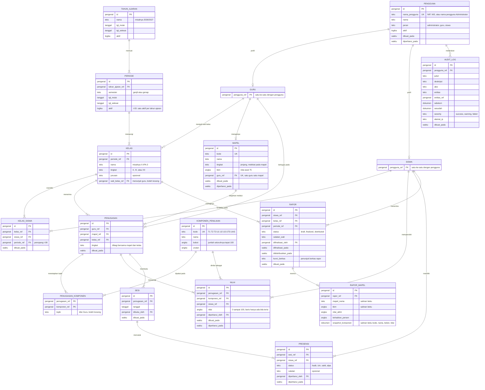

# RFC-001 — Model Data Konseptual EduTrack

| Keterangan | Isi |
|---|---|
| **Nomor** | RFC-001 |
| **Judul** | Model Data Konseptual EduTrack |
| **Status** | Diajukan |
| **Tanggal** | 5 Agustus 2026 |
| **Disusun oleh** | Re:Code |
| **Sumber kebenaran** | [PRD.md](PRD.md) v3.0 dan [ATURAN-DAN-KRITERIA.md](ATURAN-DAN-KRITERIA.md) v1.0 |
| **Menggantikan** | [SCHEMA-STATIS.md](SCHEMA-STATIS.md) dan [SCHEMA-DINAMIS.md](SCHEMA-DINAMIS.md), keduanya diturunkan menjadi arsip |
| **Dokumen lanjutan** | RFC-002 (stack dan arsitektur), RFC-003 (skema fisik), RFC-004 (kontrak API) |

> Dokumen ini menetapkan **entitas, relasi, dan aturan yang harus dijamin** oleh basis data EduTrack.
> Dokumen ini **netral teknologi**: tidak menyebut mesin basis data, tipe kolom, indeks, maupun mekanisme penegakan.
> Pemilihan mesin dan cara penegakan ditetapkan pada RFC-002 dan RFC-003.

---

## 1. Ringkasan Keputusan

| # | Keputusan |
|---|---|
| D-01 | Komponen penilaian disimpan sebagai **templat global berbasis baris**, bukan kolom tetap dan bukan rumus per mata pelajaran |
| D-02 | Mata pelajaran melekat pada **satu jenjang dan satu guru pengampu**; KKM menjadi atributnya |
| D-03 | Penugasan menyimpan guru, mata pelajaran, dan jenjang secara bersamaan agar ketidakcocokan jenjang **mustahil tersimpan** |
| D-04 | Presensi dicatat melalui entitas **sesi**, yang sekaligus menjadi penyebut persentase kehadiran |
| D-05 | Rapor memiliki **tiga status berurutan** dan satu pihak yang berwenang, tanpa tahap review dan tanpa terbit ulang |
| D-06 | Topik pembelajaran melekat pada **pasangan penugasan-komponen**, bukan pada tabel materi tersendiri |
| D-07 | Jejak audit dipertahankan dalam bentuk ringkas |
| D-08 | Keluaran AI **tidak disimpan** dalam bentuk apa pun |

---

## 2. Latar Belakang

PRD naik ke v3.0 pada 5 Agustus 2026. Dua dokumen skema yang ada — `SCHEMA-STATIS.md` dan `SCHEMA-DINAMIS.md` — disusun pada 2 Agustus 2026 berdasarkan asumsi yang kini tidak lagi berlaku. Perubahannya menyentuh bagian inti, bukan bagian pinggiran.

### 2.1 Perubahan yang membatalkan dasar skema lama

**Pembobotan menjadi templat bawaan sistem yang seragam.** [PRD.md §8.3](PRD.md) menetapkan komponen dan bobot berlaku sama untuk seluruh mata pelajaran, dan NG10 menempatkan pembobotan per mata pelajaran di luar cakupan MVP. Ini menghapus seluruh dasar `SCHEMA-DINAMIS.md`: entitas `rumus`, `komponen_rumus`, `penugasan_rumus`, tata kelola `draft → diajukan → aktif`, dan layar penyusun rumus. Tabel perbandingan pada dokumen tersebut memenangkan opsi dinamis melalui dua argumen — rumus jamak dan layar Rumus Nilai — yang keduanya kini keluar cakupan.

**Ranah penilaian menyusut ke Pengetahuan saja.** NG11 mencabut Keterampilan, Sikap Sosial, dan Sikap Spiritual.

**Keluaran AI tidak disimpan.** NG14 dan [PRD.md §8.5](PRD.md) menyatakan hasil hilang ketika halaman dimuat ulang.

### 2.2 Kebutuhan yang belum terwakili di skema mana pun

- **KKM** tidak memiliki kolom maupun entitas pada kedua skema lama, padahal [PRD.md §8.3](PRD.md) mensyaratkannya per mata pelajaran-jenjang dengan nilai awal 75.
- **Sesi presensi** tidak memiliki entitas, padahal [PRD.md §8.4](PRD.md) menjadikannya wadah pencatatan sekaligus penyebut perhitungan persentase.
- **Mata pelajaran per jenjang** dan aturan satu guru satu mata pelajaran ([PRD.md §8.2](PRD.md)) tidak terwakili pada entitas `mapel` yang lama.

### 2.3 Ketentuan lama yang bertentangan dengan PRD v3

| Ketentuan lama | Ketentuan PRD v3 |
|---|---|
| Rapor melalui tahap `review` dan disetujui Superadmin | Wali Kelas memfinalisasi dan mendistribusikan; tidak ada tahap review ([PRD.md §9](PRD.md)) |
| Rapor dapat diterbitkan ulang dengan versi baru | Tidak ada mekanisme buka kembali ([PRD.md §9](PRD.md)) |
| Rapor mata pelajaran difinalisasi Guru Mata Pelajaran | Guru Mata Pelajaran tidak melakukan finalisasi (P9, AC-08) |
| Superadmin tidak berwenang menulis nilai | Administrator memiliki akses penuh termasuk mengubah nilai (P14) |
| Presensi memiliki riwayat koreksi | Koreksi berlaku langsung tanpa pencatatan riwayat (P7) |
| AI menulis deskripsi naratif ke rapor | AI tidak menulis ke data akademik mana pun (P15, AC-20) |
| Kata sandi sementara wajib diganti pada masuk pertama | Tidak ada kewajiban penggantian ([PRD.md §6.1.3](PRD.md)) |

---

## 3. Cakupan

### 3.1 Termasuk

Entitas, atribut, relasi, kardinalitas, dan invarian yang harus dijamin sistem.

### 3.2 Tidak termasuk

| Hal | Ditetapkan pada |
|---|---|
| Mesin basis data, runtime, penerapan, penyimpanan berkas | RFC-002 |
| Mekanisme kredensial dan identitas | RFC-002 |
| Tipe kolom, indeks, constraint, pemicu, migrasi | RFC-003 |
| Kontrak endpoint dan bentuk respons | RFC-004 |

### 3.3 Kedudukan terhadap dokumen lain

`ARCHITECTURE.md`, `aktor-role.md`, dan `superadmin.md` **tidak dijadikan sumber** pada RFC ini. Ketiganya disusun sebelum PRD v3 dan memuat ketentuan yang bertentangan sebagaimana diuraikan pada §2.3. Penyelarasannya menjadi bagian RFC-002.

---

## 4. Peta Entitas

**Tujuh belas entitas dalam enam kelompok.** Setiap kelompok bergantung pada kelompok di atasnya.

| # | Kelompok | Entitas | Pertanyaan yang dijawab |
|---|---|---|---|
| 1 | Identitas | `pengguna`, `guru`, `siswa` | Siapa orang ini dan apa perannya |
| 2 | Periode akademik | `tahun_ajaran`, `periode`, `kelas`, `kelas_siswa` | Semester mana, kelas mana, siapa anggotanya |
| 3 | Kurikulum dan penugasan | `mapel`, `penugasan`, `komponen_penilaian`, `penugasan_komponen` | Siapa mengajar apa di mana, dan bagaimana dinilai |
| 4 | Pencatatan harian | `nilai`, `sesi`, `presensi` | Data yang diisi Guru sehari-hari |
| 5 | Rapor | `rapor`, `rapor_mapel` | Hasil belajar semester yang dibekukan |
| 6 | Jejak | `audit_log` | Perubahan apa yang pernah terjadi |

---

## 5. Penjelasan Keputusan

### 5.1 D-01 — Templat global berbasis baris

**Keputusan.** Komponen penilaian disimpan sebagai delapan baris pada `komponen_penilaian`, berlaku untuk seluruh mata pelajaran. Nilai disimpan satu baris per siswa per komponen per penugasan.

| Kode | Nama | Bobot |
|---|---|--:|
| T1, T2, T3 | Tugas | 6 masing-masing |
| U1, U2, U3 | Ulangan Harian | 10 masing-masing |
| UTS | Ujian Tengah Semester | 26 |
| UAS | Ujian Akhir Semester | 26 |
| | **Jumlah** | **100** |

**Alternatif yang ditolak.**

*Kolom tetap.* Menempatkan `t1` sampai `uas` sebagai kolom pada entitas nilai adalah bentuk paling sederhana dan tidak memerlukan pivot. Ditolak karena V1 pada [ATURAN-DAN-KRITERIA.md §5](ATURAN-DAN-KRITERIA.md) menyatakan angka templat **belum divalidasi sekolah**. Hasil validasi yang mengubah jumlah komponen akan memaksa perubahan struktur pada entitas yang sudah berisi data sekolah sungguhan. Selain itu kolom kosong tidak dapat membedakan "komponen tidak berlaku" dari "berlaku tetapi belum diisi", padahal AC-06 menuntut pembedaan tersebut.

*Rumus dinamis penuh.* Mempertahankan `rumus`, `komponen_rumus`, dan `penugasan_rumus` beserta lifecycle persetujuannya. Ditolak karena NG10 dan NG11 mencabut kedua kebutuhan yang membenarkannya, sehingga yang tersisa hanya kompleksitas yang tidak dipakai.

**Konsekuensi yang diterima.** Data tersimpan memanjang sedangkan layar Guru menampilkan matriks siswa terhadap komponen. Pemutaran bentuk dilakukan di lapisan aplikasi. Pada skala 30 siswa dikali 8 komponen, ini 240 baris per layar.

### 5.2 D-02 — Mata pelajaran melekat pada jenjang dan guru

**Keputusan.** `mapel` memuat `tingkat`, `kkm`, dan `guru_ref`. Satu guru mengampu paling banyak satu mata pelajaran.

**Dasar.** [PRD.md §8.2](PRD.md) menetapkan penugasan tiga lapis, dengan mata pelajaran **tidak dipilih ulang** pada lapis ketiga karena sudah melekat pada guru. KKM ditetapkan pada lapis pertama, bersamaan dengan pembuatan mata pelajaran, sehingga menjadi atribut `mapel` dan bukan entitas tersendiri.

**Konsekuensi.** Pertanyaan tentang *team teaching* — satu mata pelajaran pada satu kelas diajar lebih dari satu guru — **tertutup**. Aturan satu guru satu mata pelajaran membuatnya tidak mungkin.

### 5.3 D-03 — Penugasan menyimpan jenjang bersama

**Keputusan.** `penugasan` menyimpan `guru_ref`, `mapel_ref`, `kelas_ref`, dan `tingkat` sekaligus. Nilai `tingkat` dibagi bersama dengan `mapel` dan `kelas`.

**Dasar.** AC-24 menuntut penolakan penghubungan kelas dengan guru yang jenjang mata pelajarannya berbeda. Dengan `tingkat` dibagi bersama, ketidakcocokan jenjang menjadi keadaan yang **tidak dapat tersimpan**, bukan keadaan yang dicegah pemeriksaan aplikasi. Menyimpan `guru_ref` secara langsung juga membuat pemeriksaan kewenangan Guru (P8) tidak memerlukan penelusuran melalui `mapel`.

**Alternatif yang ditolak.** Menyimpan hanya `guru_ref` atau hanya `mapel_ref` menghasilkan bentuk paling ringkas tanpa redundansi. Ditolak karena keduanya memindahkan penegakan AC-24 ke lapisan aplikasi, dan pencabutan aturan satu guru satu mata pelajaran pasca-MVP akan memaksa perubahan bentuk entitas.

**Konsekuensi yang diterima.** Dua atribut bersifat redundan secara logika. Konsistensinya harus dijamin basis data, bukan disiplin kode; cara penjaminannya ditetapkan RFC-003.

`penugasan` **tidak** menyimpan rujukan periode. `kelas` sudah terikat pada satu periode, sehingga atribut tersebut redundan sekaligus berpotensi menyimpang.

### 5.4 D-04 — Sesi sebagai entitas

**Keputusan.** `sesi` menjadi entitas tersendiri. `presensi` bergantung pada `sesi`, bukan langsung pada tanggal.

**Dasar.** [PRD.md §8.4](PRD.md) mendefinisikan sesi sebagai satu pertemuan pada satu kelas, satu mata pelajaran, dan satu tanggal, yang dibuka Guru dan dapat dihapus. Sesi juga menjadi **penyebut** perhitungan persentase kehadiran. Tanpa entitas ini, penghapusan sesi dan perhitungan persentase tidak memiliki sandaran.

Karena `penugasan` sudah berarti guru, mata pelajaran, dan kelas sekaligus, keunikan sesi terhadap pasangan penugasan dan tanggal menerjemahkan P6 secara tepat: dua Guru mata pelajaran berbeda tetap dapat membuka sesi pada kelas dan tanggal yang sama tanpa bertabrakan.

**Yang tidak diadopsi.** Entitas riwayat koreksi presensi. [PRD.md §8.4](PRD.md) butir 3 dan 4 serta P7 menyatakan koreksi maupun penghapusan berlaku langsung **tanpa pencatatan riwayat**.

### 5.5 D-05 — Rapor tiga status, satu pihak berwenang

**Keputusan.** Status rapor bergerak maju `draft → finalized → distributed`. Finalisasi dan distribusi keduanya dilakukan Wali Kelas.

**Dasar.** [PRD.md §9](PRD.md) beserta P9 dan P13. Tidak tersedia mekanisme buka kembali; perubahan pada data yang sudah final hanya dilakukan Administrator.

**Yang dihapus dari rancangan lama.** Tahap `review`, penyetujuan oleh Superadmin, penomoran versi, dan penerbitan ulang. Ketiganya berasal dari keputusan 2 Agustus yang digantikan PRD v3.

**Rapor mata pelajaran bukan entitas alur kerja.** `rapor_mapel` adalah **salinan beku** hasil perhitungan per mata pelajaran di dalam satu rapor semester, tanpa status dan tanpa finalisasi tersendiri. Ini konsekuensi langsung P9 dan AC-08 yang mencabut kewenangan finalisasi dari Guru Mata Pelajaran.

**Rapor dibekukan, bukan dihitung ulang.** `rapor_mapel.snapshot_komponen` menyimpan salinan kode, nama, bobot, dan nilai setiap komponen pada saat finalisasi, sehingga AC-13 — rapor yang diterima siswa sama dengan data yang difinalisasi — tetap terpenuhi meskipun templat bobot berubah kemudian.

### 5.6 D-06 — Topik pada pasangan penugasan-komponen

**Keputusan.** Topik pembelajaran disimpan pada `penugasan_komponen`, satu nilai per pasangan penugasan dan komponen.

**Dasar.** [PRD.md §8.5](PRD.md) mensyaratkan AI menghimpun nilai setiap mata pelajaran **beserta topiknya**.

**Alternatif yang ditolak.**

*Entitas `materi` penuh.* Memerlukan layar CRUD Materi yang tidak ada pada [ATURAN-DAN-KRITERIA.md §3](ATURAN-DAN-KRITERIA.md) maupun PRD, sehingga menuntut penambahan cakupan.

*Topik pada entitas `nilai`.* Ditolak karena topik melekat pada komponen di satu kelas, bukan pada capaian satu siswa. Menyimpannya di `nilai` menyalin nilai yang sama ke seluruh siswa satu kelas dan membuka peluang penyimpangan antar baris.

**Konsekuensi.** Layar pengisian nilai memerlukan satu kolom tambahan untuk topik. Hal ini dicatat sebagai temuan T-01 dan perlu disampaikan kepada UI/UX.

### 5.7 D-07 — Jejak audit ringkas

**Keputusan.** `audit_log` dipertahankan dengan atribut aktor, aksi, entitas, keadaan sebelum dan sesudah, tingkat keparahan, alamat IP, dan waktu.

**Dasar.** P14 memberi Administrator kewenangan mengubah nilai yang sudah final. Perubahan itulah yang paling perlu terlacak, karena terjadi setelah rapor dikunci dan di luar sepengetahuan Guru maupun Wali Kelas.

**Batas.** Jejak audit **bukan** riwayat koreksi presensi. P7 menyatakan koreksi presensi tidak memiliki riwayat yang tampak bagi pengguna. `audit_log` melayani penelusuran administratif, bukan fitur produk.

### 5.8 D-08 — Keluaran AI tidak disimpan

**Keputusan.** Tidak ada entitas untuk keluaran AI.

**Dasar.** NG14 dan [PRD.md §8.5](PRD.md): hasil hilang ketika halaman dimuat ulang, dan menekan tombol kembali menghasilkan keluaran baru. AC-16 menjadikannya kriteria kesiapan.

**Konsekuensi.** Tidak tersedia riwayat rekomendasi yang pernah ditampilkan kepada siswa. PRD menyatakan konsekuensi ini **diterima secara sadar** untuk MVP.

---

## 6. Invarian

Setiap baris adalah pernyataan yang harus dijamin sistem. RFC-003 wajib menunjukkan cara penegakan setiap baris, dan menyatakan terang-terangan mana yang tidak dapat ditegakkan basis data sehingga menjadi tanggung jawab lapisan aplikasi.

| # | Invarian | Sumber |
|---|---|---|
| I-01 | Satu pengguna memiliki tepat satu peran | §5 |
| I-02 | Pengenal masuk unik lintas seluruh pengguna | §6.1.1, §6.1.2, P20 |
| I-03 | Satu tahun ajaran memiliki paling banyak satu semester aktif | P19 |
| I-04 | Satu mata pelajaran melekat pada tepat satu jenjang dan tepat satu guru pengampu | §8.2 |
| I-05 | Satu guru mengampu paling banyak satu mata pelajaran | §8.2 |
| I-06 | Penugasan hanya sah bila jenjang kelas sama dengan jenjang mata pelajaran | §8.2, AC-24 |
| I-07 | Satu mata pelajaran pada satu kelas diajar tepat satu guru | turunan I-04 dan I-05 |
| I-08 | Satu siswa berada pada tepat satu kelas dalam satu semester | asumsi, lihat T-02 |
| I-09 | Satu kelas memiliki paling banyak satu wali kelas per semester | P3 |
| I-10 | Jumlah bobot seluruh komponen penilaian tepat 100 | P4, AC-04 |
| I-11 | KKM bernilai awal 75 dan dapat diubah Administrator | AC-22 |
| I-12 | Nilai kosong terbedakan dari nilai nol | P5, AC-06 |
| I-13 | Satu siswa memiliki paling banyak satu nilai per komponen per penugasan | §8.3 |
| I-14 | Satu penugasan memiliki paling banyak satu sesi per tanggal | P6 |
| I-15 | Setiap siswa kelas memiliki tepat satu status pada setiap sesi | P6, AC-11 |
| I-16 | Penghapusan sesi menghapus seluruh status di dalamnya | §8.4, AC-25 |
| I-17 | Izin dan Sakit terhitung sebagai kehadiran | P16, AC-29 |
| I-18 | Penyebut persentase kehadiran adalah jumlah sesi yang dibuka Guru | §8.4 |
| I-19 | Satu siswa memiliki paling banyak satu rapor per semester | §9 |
| I-20 | Rapor hanya dapat difinalisasi bila seluruh mata pelajaran kelas lengkap | P11, AC-07 |
| I-21 | Status rapor hanya bergerak maju: draft, finalized, distributed | §9 |
| I-22 | Rapor yang sudah final tidak dapat diubah Guru maupun Wali Kelas | P13, AC-14 |
| I-23 | AI tidak pernah menulis ke data akademik | P15, §8.6, AC-20 |
| I-24 | Keluaran AI tidak disimpan | NG14, §8.5, AC-16 |
| I-25 | Siswa hanya dapat membaca datanya sendiri | P12, AC-10 |

### 6.1 Catatan penegakan

**I-12 — nilai kosong.** Baris `nilai` hanya ada apabila nilainya terisi; menghapus isian berarti menghapus baris. Dengan demikian "belum lengkap" memiliki satu representasi tunggal, yaitu ketiadaan baris, dan tidak ada nilai kosong yang ambigu. Kelengkapan dihitung dengan membandingkan jumlah komponen terhadap jumlah baris nilai yang ada.

**I-18 — penyebut persentase.** Karena I-15 menjamin setiap sesi memuat seluruh siswa kelas, jumlah sesi yang dibuka Guru sama dengan jumlah baris presensi milik satu siswa pada satu penugasan. Persentase dihitung per mata pelajaran, sesuai [PRD.md §8.4](PRD.md).

**I-20 dan I-22.** Keduanya adalah aturan alur kerja lintas entitas dan kemungkinan besar tidak dapat ditegakkan sepenuhnya oleh basis data. RFC-003 harus menyatakan hal ini secara eksplisit, bukan mengasumsikannya aman.

---

## 7. Entitas dan Atribut yang Gugur

| Entitas atau atribut | Alasan |
|---|---|
| `rumus`, `komponen_rumus`, `penugasan_rumus` | NG10 — pembobotan per mata pelajaran keluar cakupan |
| `penilaian_sikap` beserta seluruh atribut `sikap_*` dan `ket_*` | NG11 — hanya ranah Pengetahuan |
| `ai_insight` | NG14, §8.5 — keluaran AI tidak disimpan |
| `materi` | Digantikan atribut `topik` pada `penugasan_komponen` |
| `rapor.versi`, `rapor.diajukan_pada`, `rapor.disetujui_oleh` | §9 — tidak ada tahap review maupun terbit ulang |
| `rapor_mapel.deskripsi_ai` | I-23 — AI tidak menulis ke rapor |
| `guru.email`, `guru.gelar` | Tidak memiliki jalur input; §6.1.1 hanya meminta Nama dan NIP |
| `siswa.nisn`, `siswa.jenis_kelamin`, `siswa.tgl_lahir` | Tidak memiliki jalur input; §6.1.2 hanya meminta Nama dan NIS, templat §6.1.5 hanya Kelas, NIS, dan Nama |
| `guru.nip`, `siswa.nis` | Digabungkan ke `pengguna.nama_pengguna` sebagai pengenal masuk tunggal |
| `kelas_siswa.status` | NG8 — kenaikan kelas keluar cakupan, tidak ada alur mutasi |
| Riwayat koreksi nilai dan presensi | P7 — koreksi berlaku langsung tanpa pencatatan riwayat |

### 7.1 Catatan pengenal masuk

`pengguna.nama_pengguna` menjadi satu-satunya pengenal masuk: NIP untuk Guru, NIS untuk Siswa, dan nama pengguna tersendiri untuk Administrator. Menyimpannya sekaligus pada `guru.nip` dan `siswa.nis` berarti dua salinan yang dapat menyimpang, sehingga keduanya dihapus.

Konsekuensi yang diterima: NIP dan NIS berbagi satu ruang keunikan. Tabrakan praktis mustahil karena panjang digit keduanya berbeda jauh, dan apabila terjadi, sistem menolaknya saat impor dengan pesan yang menyebutkan barisnya, sesuai AC-26.

`guru` dan `siswa` menyusut menjadi entitas satu atribut. Hal ini disengaja: dengan `mapel.guru_ref` dan `kelas.wali_kelas_ref` menunjuk `guru`, menetapkan seorang siswa sebagai guru pengampu atau wali kelas menjadi mustahil di tingkat data.

---

## 8. Kendala bagi RFC-002

Model data ini mengunci sejumlah kebutuhan sebelum stack dibahas.

| # | Kendala | Dasar |
|---|---|---|
| C-01 | Data bersifat relasional sampai akar: rata-rata berbobot lintas komponen, penggabungan lintas mata pelajaran pada rapor, agregat kehadiran atas sesi, dan pemeriksaan kelengkapan lintas mata pelajaran | I-10, I-18, I-20 |
| C-02 | Diperlukan penulisan atomik atas banyak baris sekaligus; satu penekanan Simpan Nilai tidak boleh tersimpan separuh | P22, AC-15 |
| C-03 | Diperlukan penghapusan berantai atau padanannya | I-16 |
| C-04 | Diperlukan penyimpanan berkas terpisah untuk berkas rapor | §7, UC-13 |
| C-05 | Diperlukan pembedaan hak baca dan tulis pada tingkat data untuk menjamin AI tidak menulis | I-23 |
| C-06 | Volume kecil dan bukan pendorong pemilihan: sekitar 17 ribu baris nilai dan 35 ribu baris presensi per semester pada skenario 12 kelas dan 360 siswa | §8.1 |
| C-07 | Jalur AI bersifat sinkron, sekali jalan, dan hanya membaca; tidak memerlukan antrean maupun pekerjaan latar | I-23, I-24 |

C-07 patut diperhatikan. Pada rancangan sebelumnya AI berjalan sebagai pekerjaan latar yang menulis deskripsi naratif ke rapor. PRD v3 mencabut seluruh dasar tersebut, dan bersamanya sebagian besar pembenaran bagi antrean pesan.

### 8.1 Perkiraan volume

Skenario: satu semester, 3 jenjang, 4 kelas per jenjang, 30 siswa per kelas, 6 mata pelajaran per jenjang, 16 sesi presensi per mata pelajaran per semester.

Jumlah guru mengikuti I-05 — satu guru mengampu satu mata pelajaran-jenjang — sehingga 18 mata pelajaran berarti 18 guru, cukup untuk mengisi 12 posisi Wali Kelas.

| Entitas | Perkiraan baris | Perhitungan |
|---|--:|---|
| `tahun_ajaran` | 1 | — |
| `periode` | 2 | ganjil dan genap |
| `komponen_penilaian` | 8 | templat bawaan |
| `kelas` | 12 | 3 jenjang × 4 kelas |
| `mapel` | 18 | 3 jenjang × 6 mata pelajaran |
| `pengguna` | 379 | 360 siswa + 18 guru + 1 administrator |
| `kelas_siswa` | 360 | 12 kelas × 30 siswa |
| `penugasan` | 72 | 12 kelas × 6 mata pelajaran |
| `penugasan_komponen` | 576 | 72 penugasan × 8 komponen |
| `nilai` | ~17.300 | 360 siswa × 6 mapel × 8 komponen, bila lengkap |
| `sesi` | ~1.150 | 72 penugasan × 16 sesi |
| `presensi` | ~34.600 | 1.150 sesi × 30 siswa |
| `rapor` | 360 | satu per siswa per semester |
| `rapor_mapel` | ~2.160 | 360 rapor × 6 mata pelajaran |

Baris `nilai` mencapai angka di atas hanya pada akhir semester. Sepanjang semester berjalan jumlahnya lebih kecil, karena baris hanya ada apabila nilainya terisi (I-12).

---

## 9. Keputusan Terbuka

| # | Keputusan | Diputuskan pada | Dampak bila berubah |
|---|---|---|---|
| K-01 | Mekanisme kredensial: layanan identitas terkelola atau kata sandi yang dikelola sendiri | RFC-002 | Menentukan atribut kredensial pada `pengguna`. Seluruh ketentuan §6.1.3 — tanpa syarat kerumitan, tanpa kewajiban penggantian, tanpa pemulihan mandiri — merupakan penonaktifan fitur pada layanan identitas terkelola, bukan pemanfaatannya |
| K-02 | Mesin basis data, runtime, penerapan, dan penyimpanan berkas | RFC-002 | Menentukan seluruh isi RFC-003 |

---

## 10. Temuan terhadap PRD

Celah yang ditemukan saat menurunkan model data. Perlu ditanggapi tim sebelum RFC-003 dikunci.

| # | Temuan | Usulan tindakan |
|---|---|---|
| T-01 | §8.5 mensyaratkan AI membaca topik, tetapi tidak ada layar mana pun pada [ATURAN-DAN-KRITERIA.md §3](ATURAN-DAN-KRITERIA.md) yang mengisinya | Tambahkan kolom topik pada layar pengisian nilai; sampaikan kepada UI/UX |
| T-02 | I-08, satu siswa berada pada tepat satu kelas dalam satu semester, tidak dinyatakan eksplisit di PRD | Konfirmasi ke sekolah. Tanpa aturan ini rapor siswa menjadi ambigu |
| T-03 | §6.1 hanya mengatur pembuatan akun Guru dan Siswa. Tidak ada ketentuan bagaimana akun Administrator dibuat | Tetapkan pada PRD atau RFC-002; berkaitan dengan K-01 |
| T-04 | §9 menyatakan hanya Administrator yang dapat mengubah data final, tetapi rapor sudah berbentuk berkas yang terunduh. Tidak diatur apakah berkas diterbitkan ulang setelah koreksi | Tetapkan pada PRD |
| T-05 | §8.2 mengunci satu guru satu mata pelajaran, tetapi tidak ada alur pergantian guru pengampu di tengah semester | Tetapkan pada PRD |
| T-06 | Templat komponen dan bobot masih menunggu validasi sekolah (V1), sedemikian sehingga angka pada §5.1 belum final | Jalankan validasi sebelum data sekolah sungguhan dimuat |

---

## 11. Langkah Berikutnya

| Urutan | Dokumen | Masukan |
|:--:|---|---|
| 1 | RFC-001 — Model Data Konseptual | PRD v3.0 |
| 2 | RFC-002 — Stack dan Arsitektur | RFC-001, terutama §8 |
| 3 | RFC-003 — Skema Fisik | RFC-001 §6, RFC-002 |
| 4 | RFC-004 — Kontrak API | RFC-001, RFC-003 |

Penguncian berurutan dilakukan karena biaya perubahan naik pada setiap langkah. Arsitektur masih dapat diubah selama kode belum banyak; skema fisik tidak lagi dapat diubah dengan murah setelah memuat data sekolah sungguhan.

---

## Riwayat

| Tanggal | Perubahan |
|---|---|
| 5 Agustus 2026 | Dokumen dibuat. Menggantikan `SCHEMA-STATIS.md` dan `SCHEMA-DINAMIS.md`, keduanya diturunkan menjadi arsip |
